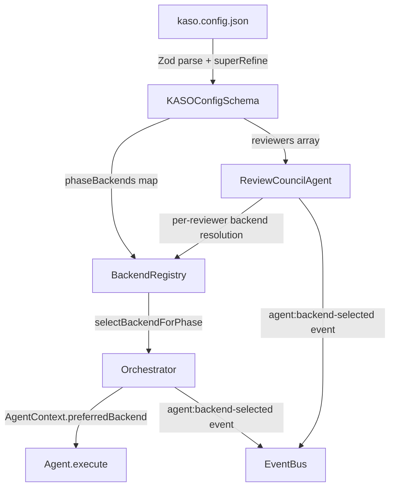
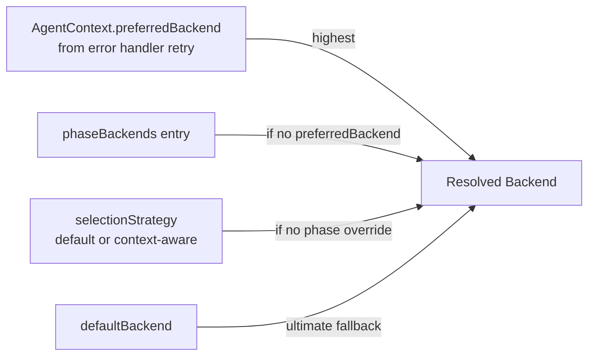
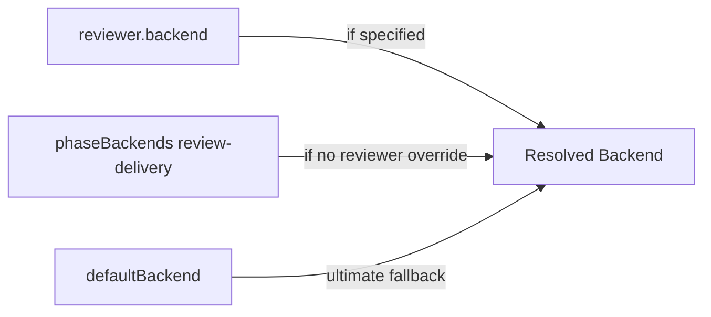

# Design Document: Configurable Backends & Review Council

## Overview

This feature introduces two tightly coupled capabilities to KASO:

1. **Per-phase backend selection** — A `phaseBackends` config map (`Record<PhaseName, BackendName>`) that lets users assign specific AI backends to individual pipeline phases, overriding the global `defaultBackend` and `backendSelectionStrategy`.

2. **Configurable review council** — A `reviewers` array in the `reviewCouncil` config that replaces the fixed 3-perspective model with variable reviewer count, per-reviewer backend assignment, and arbitrary custom perspectives (e.g., `"accessibility"`, `"compliance"`).

Both features share the backend name reference space from `executorBackends[]` and are validated together via cross-field Zod refinements at config load time. The design preserves full backward compatibility with existing configs that use `perspectives` or omit `phaseBackends` entirely.

### Key Design Decisions

- **Zod `.superRefine()` for cross-field validation** — Backend name references in `phaseBackends` and `reviewers[].backend` are validated against the `executorBackends` array using a single `.superRefine()` pass on `KASOConfigSchema`. This catches invalid/disabled backend references at load time with descriptive error paths.
- **`BackendRegistry.selectBackendForPhase()`** — A new method that encapsulates the resolution chain: phase override → selection strategy → default. The orchestrator calls this instead of `selectBackend()` directly.
- **`ReviewVote.perspective` widened to `string`** — The `ReviewPerspective` union type is kept for backward compat but `ReviewVote.perspective` becomes `string` to support custom roles. Existing code reading `.perspective` continues to compile.
- **Fallback chain for reviewer backends** — `reviewer.backend` → `phaseBackends['review-delivery']` → `defaultBackend`. This is resolved at runtime in `ReviewCouncilAgent` using the injected `BackendRegistry`.
- **Generalized consensus with `Math.floor(n * 2 / 3)`** — The hardcoded 2/3 threshold is replaced with a formula that works for any reviewer count ≥ 1.

## Architecture

### Component Interaction Flow



### Backend Resolution Priority Chain



### Reviewer Backend Resolution Chain



## Components and Interfaces

### 1. `src/config/schema.ts` — Schema Changes

#### New: `ReviewerConfigSchema`

```typescript
export const ReviewerConfigSchema = z.object({
  role: z.string().min(1),
  backend: z.string().min(1).optional(),
})

export type ReviewerConfig = z.infer<typeof ReviewerConfigSchema>
```

#### New: `PhaseNameSchema` (for phaseBackends keys)

```typescript
const PhaseNameSchema = z.union([
  z.enum([
    'intake', 'validation', 'architecture-analysis', 'implementation',
    'architecture-review', 'test-verification', 'ui-validation', 'review-delivery',
  ]),
  z.string().regex(/^custom-[a-z0-9-]+$/),
])
```

> **Note:** Custom phase names in `phaseBackends` are syntactically validated (must match `custom-[a-z0-9-]+`) but are not checked against registered custom phases at load time. If a backend is assigned to a custom phase that doesn't exist in the pipeline, the configuration is valid but the override will never be used.

#### Modified: `ReviewCouncilConfigSchema`

Add `reviewers` field alongside existing `perspectives`:

```typescript
export const ReviewCouncilConfigSchema = z.object({
  maxReviewRounds: z.number().int().positive().default(2),
  enableParallelReview: z.boolean().default(false),
  reviewBudgetUsd: z.number().positive().optional(),
  perspectives: z
    .array(z.enum(['security', 'performance', 'maintainability']))
    .default(['security', 'performance', 'maintainability']),
  reviewers: z
    .array(ReviewerConfigSchema)
    .min(1)
    .refine(
      (arr) => new Set(arr.map((r) => r.role)).size === arr.length,
      { message: 'Reviewer roles must be unique' },
    )
    .optional(),
})
```

#### Modified: `KASOConfigSchema`

Add `phaseBackends` field and cross-field validation:

```typescript
export const KASOConfigSchema = z.object({
  // ... existing fields ...
  phaseBackends: z.record(PhaseNameSchema, z.string().min(1)).default({}),
  // ... rest of fields ...
}).superRefine((config, ctx) => {
  const enabledBackends = new Set(
    config.executorBackends.filter((b) => b.enabled).map((b) => b.name),
  )
  const allBackends = new Set(config.executorBackends.map((b) => b.name))

  // Validate phaseBackends references
  for (const [phase, backendName] of Object.entries(config.phaseBackends)) {
    if (!allBackends.has(backendName)) {
      ctx.addIssue({
        code: z.ZodIssueCode.custom,
        path: ['phaseBackends', phase],
        message: `Backend '${backendName}' for phase '${phase}' not found. Available: ${[...enabledBackends].join(', ')}`,
      })
    } else if (!enabledBackends.has(backendName)) {
      ctx.addIssue({
        code: z.ZodIssueCode.custom,
        path: ['phaseBackends', phase],
        message: `Backend '${backendName}' for phase '${phase}' is disabled`,
      })
    }
  }

  // Validate reviewer backend references
  const reviewers = config.reviewCouncil?.reviewers
  if (reviewers) {
    for (let i = 0; i < reviewers.length; i++) {
      const reviewer = reviewers[i]
      if (reviewer.backend) {
        if (!allBackends.has(reviewer.backend)) {
          ctx.addIssue({
            code: z.ZodIssueCode.custom,
            path: ['reviewCouncil', 'reviewers', i, 'backend'],
            message: `Backend '${reviewer.backend}' for reviewer '${reviewer.role}' not found. Available: ${[...enabledBackends].join(', ')}`,
          })
        } else if (!enabledBackends.has(reviewer.backend)) {
          ctx.addIssue({
            code: z.ZodIssueCode.custom,
            path: ['reviewCouncil', 'reviewers', i, 'backend'],
            message: `Backend '${reviewer.backend}' for reviewer '${reviewer.role}' is disabled`,
          })
        }
      }
    }

    // Warn if >10 reviewers
    if (reviewers.length > 10) {
      ctx.addIssue({
        code: z.ZodIssueCode.custom,
        path: ['reviewCouncil', 'reviewers'],
        message: 'Warning: more than 10 reviewers configured (recommended max is 10)',
      })
    }
  }
})
```

### 2. `src/backends/backend-registry.ts` — Phase-Aware Selection

> When `selectBackendForPhase()` is called with a phase override, if the backend exists but `isAvailable()` returns `false`, the method throws an error (fail-fast) rather than falling back. This ensures configuration errors are caught early.

#### New Fields

```typescript
private phaseOverrides: Map<string, string>  // PhaseName → BackendName
```

#### Constructor Change

```typescript
constructor(config: KASOConfig) {
  // ... existing registration logic ...
  this.phaseOverrides = new Map(Object.entries(config.phaseBackends ?? {}))
}
```

#### New Methods

```typescript
selectBackendForPhase(phase: PhaseName, context?: AgentContext): ExecutorBackend {
  // 1. Check phase override
  const override = this.phaseOverrides.get(phase)
  if (override) {
    const backend = this.backends.get(override)
    if (!backend) {
      throw new Error(
        `Backend '${override}' configured for phase '${phase}' is not available. ` +
        `Available backends: ${Array.from(this.backends.keys()).join(', ')}`,
      )
    }
    // Fail-fast: if the backend exists but is unavailable, throw rather than falling back.
    // This ensures configuration errors are caught early.
    return backend
  }
  // 2. Fall back to existing selection strategy
  return this.selectBackend(context)
}

hasPhaseOverride(phase: PhaseName): boolean {
  return this.phaseOverrides.has(phase)
}

getPhaseOverride(phase: PhaseName): string | undefined {
  return this.phaseOverrides.get(phase)
}
```

### 3. `src/core/orchestrator.ts` — Integration Points

#### Modified: `executePhase()`

After selecting the backend, emit `agent:backend-selected` event and pass the resolved backend name into `AgentContext`:

```typescript
// In executePhase(), after acquiring concurrency slot:
// Delegate to BackendRegistry.selectBackendForPhase() — do NOT duplicate the resolution chain.
const backend = context.preferredBackend
  ? this.backendRegistry.getBackend(context.preferredBackend)
  : this.backendRegistry.selectBackendForPhase(phase, context)
const resolvedBackendName = backend.name

const selectionReason = context.preferredBackend
  ? 'retry-override'
  : this.backendRegistry.hasPhaseOverride(phase)
    ? 'phase-override'
    : this.backendRegistry.getSelectionStrategy() === 'context-aware'
      ? 'context-aware'
      : 'default'

this.eventBus.emit({
  type: 'agent:backend-selected',
  runId: runInfo.runId,
  timestamp: nowISO(),
  phase,
  data: { backend: resolvedBackendName, reason: selectionReason },
})
```

> The orchestrator must NOT duplicate the resolution chain. `selectBackendForPhase()` already encapsulates phase override → selection strategy → default. The orchestrator only keeps the `selectionReason` determination separate because the registry doesn't track reasons.

#### Modified: `buildAgentContext()`

Set `preferredBackend` from phase override when no retry context override exists:

```typescript
// After existing retry context logic:
if (!context.preferredBackend && phase) {
  const phaseOverride = this.backendRegistry.getPhaseOverride(phase)
  if (phaseOverride) {
    context.preferredBackend = phaseOverride
  }
}
```

### 4. `src/agents/review-council.ts` — Refactoring

#### Updated Dependencies

```typescript
interface ReviewCouncilDependencies {
  eventBus?: EventBus
  backendRegistry: BackendRegistry  // Required — single source of backend resolution
}
```

> `backendResolver` is removed entirely. `BackendRegistry` is the single source of truth for backend resolution. Making it required ensures the agent always has access to the registry at construction time.

#### Reviewer Resolution

The agent reads `config.reviewCouncil.reviewers` if present, otherwise converts `perspectives` to `ReviewerConfig[]`:

```typescript
private getEffectiveReviewers(config: ReviewCouncilConfig): ReviewerConfig[] {
  if (config.reviewers && config.reviewers.length > 0) {
    return config.reviewers
  }
  // Legacy: convert perspectives to ReviewerConfig
  const perspectives = config.perspectives ?? ['security', 'performance', 'maintainability']
  return perspectives.map((p) => ({ role: p }))
}
```

#### Per-Reviewer Backend Resolution

```typescript
private resolveReviewerBackend(
  reviewer: ReviewerConfig,
  context: AgentContext,
): ExecutorBackend | undefined {
  // 1. Reviewer-specific backend
  if (reviewer.backend) {
    return this.backendRegistry.getBackend(reviewer.backend)
  }
  // 2. Phase backend for review-delivery
  if (this.backendRegistry.hasPhaseOverride('review-delivery')) {
    const phaseOverride = this.backendRegistry.getPhaseOverride('review-delivery')!
    return this.backendRegistry.getBackend(phaseOverride)
  }
  // 3. Default backend
  return this.backendRegistry.getBackend(context.config.defaultBackend)
}
```

#### Event Emission for Per-Reviewer Backend Selection

When a reviewer has an explicit backend override, the agent emits an `agent:backend-selected` event with `reviewer-override` reason:

```typescript
// In ReviewCouncilAgent.executePerspectiveReview():
if (reviewer.backend) {
  this.eventBus?.emit({
    type: 'agent:backend-selected',
    runId: context.runId,
    timestamp: new Date().toISOString(),
    phase: 'review-delivery',
    data: {
      backend: resolvedBackend.name,
      reason: 'reviewer-override',
      reviewerRole: reviewer.role,
    },
  })
}
```

#### Generalized Consensus Logic

```typescript
private determineConsensus(
  votes: ReviewVote[],
): 'passed' | 'passed-with-warnings' | 'rejected' {
  // Deduplicate by perspective — if a reviewer voted in multiple rounds,
  // only their latest vote counts toward consensus
  const latestVotes = new Map<string, ReviewVote>()
  for (const vote of votes) {
    latestVotes.set(vote.perspective, vote)
  }

  const uniqueVotes = Array.from(latestVotes.values())
  const approvalCount = uniqueVotes.filter((v) => v.approved).length
  const totalCount = uniqueVotes.length

  if (totalCount === 0) return 'rejected'
  if (approvalCount === totalCount) return 'passed'
  if (approvalCount >= Math.floor(totalCount * 2 / 3)) return 'passed-with-warnings'
  return 'rejected'
}
```

#### Custom Perspective Heuristic Fallback

For custom roles without a backend, the agent performs a generic heuristic review checking architecture violations and test pass/fail status, and includes a warning that heuristic review was used:

```typescript
private executeGenericHeuristicReview(
  role: string,
  reviewContext: ReviewContext,
): PerspectiveReviewResult {
  const issues: string[] = []
  if (reviewContext.architectureViolations.length > 0) {
    issues.push(`${reviewContext.architectureViolations.length} architecture violations`)
  }
  if (!reviewContext.testPassed) {
    issues.push('Tests are failing')
  }
  return {
    vote: {
      perspective: role,
      approved: issues.length === 0,
      feedback: issues.length === 0
        ? `Generic heuristic review passed for '${role}'`
        : `Heuristic review for '${role}': ${issues.join('; ')} (heuristic — no backend available)`,
      severity: issues.length > 0 ? 'medium' : 'low',
    },
    tokensUsed: 0,
    cost: 0,
  }
}
```

### 5. `src/core/types.ts` — Type Updates

#### `ReviewPerspective` — Deprecation

```typescript
/**
 * @deprecated Use `string` for custom perspectives. Kept for backward compatibility.
 */
export type ReviewPerspective = 'security' | 'performance' | 'maintainability'
```

#### `EventType` — Add new event

```typescript
export type EventType =
  | /* ... existing ... */
  | 'agent:backend-selected'
```

#### `ReviewCouncilResult.votes` — Widen perspective type

```typescript
export interface ReviewCouncilResult extends PhaseOutput {
  consensus: 'passed' | 'passed-with-warnings' | 'rejected'
  votes: Array<{
    perspective: string  // was: 'security' | 'performance' | 'maintainability'
    approved: boolean
    feedback: string
    severity: 'high' | 'medium' | 'low'
  }>
  rounds: number
  cost: number
}
```

### 6. `src/core/event-bus.ts` — No Code Changes

The `EventBus` is already generic over `EventType`. Adding `'agent:backend-selected'` to the `EventType` union in `types.ts` is sufficient.

## Data Models

### Configuration Shape (after changes)

```typescript
interface KASOConfig {
  // ... existing fields ...
  phaseBackends: Record<string, string>  // PhaseName → BackendName, defaults to {}

  reviewCouncil: {
    maxReviewRounds: number
    enableParallelReview: boolean
    reviewBudgetUsd?: number
    perspectives: ('security' | 'performance' | 'maintainability')[]  // legacy
    reviewers?: ReviewerConfig[]  // NEW: takes precedence over perspectives
  }
}

interface ReviewerConfig {
  role: string      // e.g., "security", "accessibility", "compliance"
  backend?: string  // optional backend override
}
```

### Example Config

```jsonc
{
  "executorBackends": [
    { "name": "claude-code", "command": "claude", "args": [], "protocol": "cli-json", "maxContextWindow": 200000, "costPer1000Tokens": 0.015 },
    { "name": "kimi-code", "command": "kimi", "args": [], "protocol": "cli-json", "maxContextWindow": 128000, "costPer1000Tokens": 0.01 }
  ],
  "defaultBackend": "kimi-code",
  "phaseBackends": {
    "implementation": "claude-code",
    "architecture-review": "claude-code"
    // review-delivery not overridden — reviewers without explicit backend fall back to defaultBackend ("kimi-code")
  },
  "reviewCouncil": {
    "maxReviewRounds": 2,
    "reviewers": [
      { "role": "security", "backend": "claude-code" },   // explicit override → uses claude-code
      { "role": "performance" },                           // no override, no phaseBackends['review-delivery'] → falls back to defaultBackend ("kimi-code")
      { "role": "accessibility" },                         // same fallback → "kimi-code"
      { "role": "compliance", "backend": "claude-code" }   // explicit override → uses claude-code
    ]
  }
}
```

### Backend Selection Event Payload

```typescript
{
  type: 'agent:backend-selected',
  runId: string,
  timestamp: string,
  phase: PhaseName,
  data: {
    backend: string,           // resolved backend name
    reason: 'phase-override' | 'context-aware' | 'default' | 'reviewer-override' | 'retry-override',
    reviewerRole?: string,     // only present for reviewer-override
  }
}
```

> Note: `'retry-override'` is emitted when `AgentContext.preferredBackend` is set from error handler retry logic (Requirement 11.2 lists 4 reasons, but `retry-override` is an additional reason needed to distinguish retry-driven backend selection from the other 4).


## Correctness Properties

*A property is a characteristic or behavior that should hold true across all valid executions of a system — essentially, a formal statement about what the system should do. Properties serve as the bridge between human-readable specifications and machine-verifiable correctness guarantees.*

### Property 1: Valid config schema round-trip

*For any* configuration object containing a valid `phaseBackends` map (with keys from the 8 built-in phases or matching `custom-[a-z0-9-]+`) referencing enabled backends, and/or a valid `reviewers` array with unique non-empty roles referencing enabled backends, and/or a legacy `perspectives` array without `reviewers`, parsing through `KASOConfigSchema` shall succeed and the parsed output shall preserve all `phaseBackends` entries and `reviewers` entries.

**Validates: Requirements 1.1, 1.2, 1.5, 4.1, 5.3**

### Property 2: Cross-field backend reference rejection

*For any* configuration where a `phaseBackends` value or a `reviewers[].backend` value references a backend name that either does not exist in `executorBackends` or exists but has `enabled: false`, parsing through `KASOConfigSchema` shall fail with a `ZodError` whose issues include the invalid backend name and the field path where it was referenced.

**Validates: Requirements 1.3, 1.4, 6.3, 6.4, 10.1, 10.2, 10.3**

### Property 3: Phase override returns configured backend

*For any* `BackendRegistry` constructed with a `phaseBackends` map, and *for any* phase that has an entry in that map, calling `selectBackendForPhase(phase)` shall return the backend whose name matches the override value, ignoring the default backend and selection strategy.

**Validates: Requirements 2.1, 3.1, 3.2**

### Property 4: No-override fallback to selection strategy

*For any* `BackendRegistry` constructed with a `phaseBackends` map, and *for any* phase that does NOT have an entry in that map, calling `selectBackendForPhase(phase, context)` shall return the same backend as calling `selectBackend(context)`.

**Validates: Requirements 2.2, 2.6, 3.3**

### Property 5: preferredBackend takes priority over phase override

*For any* phase with both a `phaseBackends` override and a `preferredBackend` set on the `AgentContext`, the orchestrator shall use the `preferredBackend` value, not the phase override.

**Validates: Requirements 2.3, 2.4**

### Property 6: Phase override map consistency

*For any* `BackendRegistry` constructed with a `phaseBackends` map, and *for any* phase name, `hasPhaseOverride(phase)` returns `true` if and only if `getPhaseOverride(phase)` returns a defined (non-undefined) value, and both are consistent with the entries in the original `phaseBackends` map.

**Validates: Requirements 3.4, 3.6, 3.7**

### Property 7: Reviewer count matches votes with correct perspectives

*For any* `reviewers` array of length N with unique roles, the `ReviewCouncilAgent` shall produce a `ReviewCouncilResult` where the set of unique `perspective` values in the votes array equals the set of `role` strings from the reviewers array, and there is at least one vote per reviewer per round.

**Validates: Requirements 4.2, 8.2, 8.4, 9.1**

### Property 8: Legacy perspectives conversion

*For any* configuration with a `perspectives` array and no `reviewers` array, the `ReviewCouncilAgent` shall produce votes whose perspective values exactly match the perspectives array entries.

**Validates: Requirements 5.1, 5.3**

### Property 9: Reviewers take precedence over perspectives

*For any* configuration where both `reviewers` and `perspectives` are provided, the `ReviewCouncilAgent` shall produce votes whose perspective values match the `reviewers[].role` values, not the `perspectives` values.

**Validates: Requirements 4.3, 5.2**

### Property 10: Unique role validation rejects duplicates

*For any* `reviewers` array containing two or more entries with the same `role` string, parsing through `ReviewCouncilConfigSchema` shall fail with a validation error mentioning uniqueness.

**Validates: Requirement 4.7**

### Property 11: Generalized consensus formula

*For any* total reviewer count N ≥ 1 and approval count A where 0 ≤ A ≤ N, the consensus logic shall return:
- `"passed"` when A = N
- `"passed-with-warnings"` when A < N and A ≥ Math.floor(N * 2 / 3)
- `"rejected"` when A < Math.floor(N * 2 / 3)

**Validates: Requirements 7.1, 7.2, 7.3, 7.6**

### Property 12: Reviewer backend fallback chain

*For any* reviewer configuration, the resolved backend shall follow the chain: if `reviewer.backend` is set, use it; else if `phaseBackends['review-delivery']` is set, use it; else use `defaultBackend`. The resolved backend at each step must be the first defined value in this chain.

**Validates: Requirements 6.1, 6.2, 6.6**

### Property 13: Custom role heuristic fallback includes warning

*For any* custom role string (not one of the 3 built-in perspectives) where no backend is available, the heuristic review vote's feedback shall contain the role name and an indication that heuristic review was used.

**Validates: Requirement 8.3**

### Property 14: Backend selection event reason validity

*For any* `agent:backend-selected` event emitted during pipeline execution, the `reason` field in the event data shall be one of `"phase-override"`, `"context-aware"`, `"default"`, `"reviewer-override"`, or `"retry-override"`.

**Validates: Requirements 11.1, 11.2, 11.3**

## Error Handling

### Configuration Errors (Load Time)

| Error Condition | Behavior |
|---|---|
| `phaseBackends` references non-existent backend | `ZodError` with path `['phaseBackends', phaseName]` and message listing available backends |
| `phaseBackends` references disabled backend | `ZodError` with path `['phaseBackends', phaseName]` and message identifying disabled status |
| `reviewers[].backend` references non-existent backend | `ZodError` with path `['reviewCouncil', 'reviewers', index, 'backend']` and message listing available backends |
| `reviewers[].backend` references disabled backend | `ZodError` with path `['reviewCouncil', 'reviewers', index, 'backend']` and message identifying disabled status |
| `reviewers` array is empty | `ZodError` — min(1) constraint violation |
| `reviewers` has duplicate roles | `ZodError` — refine constraint with "Reviewer roles must be unique" message |
| `reviewers` has empty role string | `ZodError` — min(1) constraint on role field |
| `reviewers` has >10 entries | `ZodError` warning (non-fatal in superRefine) |

### Runtime Errors

| Error Condition | Behavior |
|---|---|
| Phase override backend becomes unavailable at runtime | `BackendRegistry.selectBackendForPhase()` throws with descriptive message including backend name and phase |
| Reviewer backend unavailable at runtime | `ReviewCouncilAgent` falls back to heuristic review for that reviewer, continues execution |
| All reviewer backends unavailable | Full heuristic review for all reviewers — no crash, degraded quality with warnings in feedback |
| Backend selection event emission fails | Swallowed — event bus listeners handle errors internally, pipeline continues |

### Backward Compatibility Guarantees

- Configs without `phaseBackends` continue to work identically (field defaults to `{}`)
- Configs with only `perspectives` (no `reviewers`) continue to work — perspectives are converted to reviewer configs internally
- `ReviewVote.perspective` widened from union to `string` — existing code reading `.perspective` as string continues to compile
- `ReviewCouncilResult` shape unchanged except for the widened `perspective` type

## Testing Strategy

### Property-Based Testing

Property-based tests use `@fast-check/vitest` (already in devDependencies). Each property test runs a minimum of 100 iterations.

Tests go in `tests/property/` directory, extending existing property test files where appropriate:

- `tests/property/backend-registry.property.test.ts` — Properties 3, 4, 6
- `tests/property/review-council.property.test.ts` — Properties 7, 8, 9, 11, 12, 13
- `tests/property/config-validation.property.test.ts` (new) — Properties 1, 2, 10
- `tests/property/orchestrator.property.test.ts` — Properties 5, 14

Each property test must be tagged with a comment referencing the design property:

```typescript
// Feature: configurable-backends-review, Property 11: Generalized consensus formula
```

### Integration Tests

Integration tests verify end-to-end behavior across component boundaries:

- `tests/integration/backend-selection.integration.test.ts` — Full pipeline run with `phaseBackends` configuration, verifying the correct backend is used for each phase through the entire execution flow
- `tests/integration/review-council-custom.integration.test.ts` — Review council execution with custom reviewers and per-reviewer backends, verifying consensus determination and `agent:backend-selected` event emission with correct reasons

### Unit Testing

Unit tests complement property tests for specific examples and edge cases:

- `tests/config/loader.test.ts` — Cross-field validation error messages, edge cases (empty phaseBackends, >10 reviewers warning)
- `tests/backends/backend-registry.test.ts` — `selectBackendForPhase()` with unavailable backend error, `hasPhaseOverride()`/`getPhaseOverride()` basic behavior
- `tests/agents/review-council.test.ts` — Default 3-reviewer fallback (Req 4.4), single reviewer consensus edge cases (Req 7.4, 7.5), 2-reviewer edge cases (Req 7.7, 7.8), 4-reviewer edge case (Req 7.9), heuristic fallback for custom roles, `agent:backend-selected` event emission with `reviewer-override` reason
- `tests/core/event-bus.test.ts` — `agent:backend-selected` event type acceptance

### Test Coverage Targets

- Schema validation: 100% branch coverage on superRefine cross-field validation
- BackendRegistry new methods: 100% line coverage
- ReviewCouncilAgent consensus logic: 100% branch coverage
- Orchestrator backend resolution: covered via property tests on buildAgentContext

