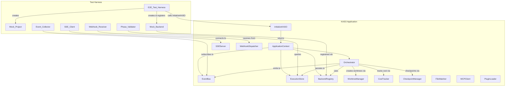

# Design Document: End-to-End Validation

## Overview

This design describes a comprehensive end-to-end validation test suite for KASO that exercises the full 8-phase pipeline and all supporting subsystems using mock backends, temporary project fixtures, and in-memory persistence. The test suite proves KASO works as a complete orchestration system — not just that individual components pass isolated tests.

The suite is organized into 4 tiers matching CI execution strategy:
- **Tier 1** (every commit): Core pipeline — scaffolding, mock backends, full 8-phase run, phase outputs, execution store
- **Tier 2** (PR): Error handling — crash recovery, cost budgets, concurrency rejection, pause/resume, retries
- **Tier 3** (PR): Integration features — worktrees, SSE streaming, webhooks, CLI, plugins, MCP, file watcher
- **Tier 4** (nightly): Advanced scenarios — backend selection, phase overrides, review council config, context capping, timeouts, spec writer, abort signals

All tests run against `initializeKASO()` with real component wiring but mock `ExecutorBackend` implementations, in-memory SQLite, and temporary filesystem fixtures. No real AI backends are spawned.

## Architecture



The test harness wraps `initializeKASO()` from `src/index.ts`, passing a programmatic `KASOConfig` with mock backends. After initialization, it swaps the `CLIProcessBackend` instances for `Mock_Backend` instances via `BackendRegistry.registerBackend()`. Each test scenario then calls `orchestrator.startRun()` and asserts against collected events, execution store records, and side effects.

### Key Design Decisions

1. **Use `initializeKASO()` directly** rather than constructing components manually. This validates the real wiring path and catches integration bugs that manual construction would miss.

2. **Mock at the backend boundary** — `ExecutorBackend` is the only mock. All other components (EventBus, ExecutionStore, Orchestrator, StateMachine, etc.) are real. This maximizes the "end-to-end" coverage.

3. **In-memory SQLite** for the execution store (`path: ':memory:'`) eliminates filesystem pollution and enables parallel test execution.

4. **Temporary directories** for mock projects and worktrees, cleaned up in `afterEach`/`afterAll` hooks.

5. **Tier-based organization** with Vitest `describe` blocks and file naming conventions (`*.tier1.e2e.test.ts`) enabling selective CI execution via glob patterns.

## Components and Interfaces

### E2E_Test_Harness

The top-level test utility that orchestrates fixture creation and KASO initialization.

```typescript
interface E2ETestHarness {
  /** Create temp directory with valid kaso.config.json, mock specs, steering files */
  setup(options?: HarnessOptions): Promise<HarnessContext>

  /** Tear down temp directory, clean up worktrees */
  teardown(ctx: HarnessContext): Promise<void>
}

interface HarnessOptions {
  /** Override config values */
  configOverrides?: Partial<KASOConfig>
  /** Number of mock backends to register */
  backendCount?: number
  /** Backend behavior presets */
  backendPresets?: MockBackendPreset[]
  /** Enable SSE server */
  enableSSE?: boolean
  /** Enable webhooks with local receiver */
  enableWebhooks?: boolean
  /** Enable file watcher */
  enableFileWatcher?: boolean
  /** Enable MCP client */
  enableMCP?: boolean
}

interface HarnessContext {
  /** The initialized KASO ApplicationContext */
  app: ApplicationContext
  /** Path to the temporary project directory */
  projectDir: string
  /** Path to the mock spec directory */
  specPath: string
  /** Registered mock backends by name */
  backends: Map<string, MockBackend>
  /** Event collector subscribed to EventBus */
  eventCollector: EventCollector
  /** Phase validator for ExecutionStore queries */
  phaseValidator: PhaseValidator
  /** Webhook receiver (if enabled) */
  webhookReceiver?: WebhookReceiver
}

interface MockBackendPreset {
  name: string
  phaseResponses?: Map<PhaseName, MockPhaseResponse>
  delayMs?: number
  available?: boolean
}
```

### Mock_Backend

Implements `ExecutorBackend` with configurable behavior per phase.

```typescript
class MockBackend implements ExecutorBackend {
  readonly name: string
  readonly protocol: BackendProtocol = 'cli-json'
  readonly maxContextWindow: number
  readonly costPer1000Tokens: number

  private phaseResponses: Map<PhaseName, MockPhaseResponse>
  private progressCallbacks: Array<(event: BackendProgressEvent) => void>
  private executionLog: BackendRequest[]
  private available: boolean
  private delayMs: number

  constructor(config: MockBackendConfig)

  /** Configure response for a specific phase */
  setPhaseResponse(phase: PhaseName, response: MockPhaseResponse): void

  /** Configure a delay before responding */
  setDelay(ms: number): void

  /** Set availability (for testing unavailable backends) */
  setAvailable(available: boolean): void

  /** Get log of all execute() calls for assertion */
  getExecutionLog(): BackendRequest[]

  /** Reset execution log */
  resetLog(): void

  // ExecutorBackend interface
  async execute(request: BackendRequest): Promise<BackendResponse>
  async isAvailable(): Promise<boolean>
  onProgress(callback: (event: BackendProgressEvent) => void): void
}

interface MockBackendConfig {
  name: string
  protocol?: BackendProtocol  // defaults to 'cli-json', configurable for protocol testing
  maxContextWindow?: number
  costPer1000Tokens?: number
  defaultTokensUsed?: number
  defaultDelay?: number
}

interface MockPhaseResponse {
  success: boolean
  output?: PhaseOutput
  tokensUsed?: number
  error?: string
  retryable?: boolean
}
```

### Mock_Project

Creates a realistic temporary project directory.

```typescript
interface MockProjectConfig {
  featureName?: string
  specContent?: { designMd?: string; tasksMd?: string }
  steeringFiles?: { codingPractices?: string; personality?: string }
  configOverrides?: Partial<KASOConfig>
}

/** Creates temp dir with kaso.config.json, .kiro/specs/, .kiro/steering/ */
function createMockProject(config?: MockProjectConfig): Promise<MockProjectResult>

interface MockProjectResult {
  projectDir: string
  specPath: string
  configPath: string
  cleanup: () => Promise<void>
}
```

### Event_Collector

Subscribes to `EventBus.onAny()` and accumulates events for assertion.

```typescript
class EventCollector {
  private events: ExecutionEvent[]
  private unsubscribe: () => void

  constructor(eventBus: EventBus)

  /** Get all collected events */
  getEvents(): ExecutionEvent[]

  /** Get events filtered by type */
  getByType(type: EventType): ExecutionEvent[]

  /** Get events filtered by run ID */
  getByRunId(runId: string): ExecutionEvent[]

  /** Get events for a specific phase */
  getByPhase(phase: PhaseName): ExecutionEvent[]

  /** Assert minimum event count for a type */
  assertMinCount(type: EventType, min: number): void

  /** Assert event ordering (type A before type B) */
  assertOrdering(before: EventType, after: EventType): void

  /** Clear collected events */
  clear(): void

  /** Unsubscribe from EventBus */
  dispose(): void
}
```

### Phase_Validator

Queries `ExecutionStore` and validates phase result records.

```typescript
class PhaseValidator {
  constructor(private executionStore: ExecutionStore)

  /** Verify all 8 phases completed successfully */
  assertAllPhasesCompleted(runId: string): void

  /** Verify phase sequence numbers are monotonically increasing 0..7 */
  assertSequenceOrder(runId: string): void

  /** Verify each phase has valid timing (non-zero duration, valid timestamps) */
  assertValidTiming(runId: string): void

  /** Verify a specific phase output matches expected interface shape */
  assertPhaseOutputShape(runId: string, phase: PhaseName, expectedKeys: string[]): void

  /** Get phase results for a run */
  getPhaseResults(runId: string): PhaseResultRecord[]
}
```

### Webhook_Receiver

A local HTTP server that captures webhook POST requests.

```typescript
class WebhookReceiver {
  private server: http.Server
  private receivedPayloads: WebhookReceivedPayload[]
  private port: number

  constructor()

  /** Start the receiver on an OS-assigned port */
  async start(): Promise<number>

  /** Stop the receiver */
  async stop(): Promise<void>

  /** Get the receiver URL */
  getUrl(): string

  /** Get all received payloads */
  getPayloads(): WebhookReceivedPayload[]

  /** Get payloads filtered by event type */
  getByEvent(event: string): WebhookReceivedPayload[]

  /** Configure response behavior (e.g., return 5xx for retry testing) */
  setResponseCode(code: number): void

  /** Clear received payloads */
  clear(): void
}

interface WebhookReceivedPayload {
  body: WebhookPayload
  headers: Record<string, string>
  receivedAt: Date
}
```

### SSE_Client

A test HTTP client that connects to the SSE endpoint and collects events.

```typescript
class SSEClient {
  private receivedEvents: SSEReceivedEvent[]
  private request: http.ClientRequest | null

  constructor(private baseUrl: string)

  /** Connect to the SSE endpoint with optional filters */
  connect(options?: { runId?: string; lastEventId?: string; authToken?: string }): Promise<void>

  /** Disconnect from the SSE endpoint */
  disconnect(): void

  /** Get all received events */
  getEvents(): SSEReceivedEvent[]

  /** Wait for a specific event type (with timeout) */
  waitForEvent(type: EventType, timeoutMs?: number): Promise<SSEReceivedEvent>

  /** Clear received events */
  clear(): void
}

interface SSEReceivedEvent {
  id?: string
  type?: string
  data: string
  parsed?: SSEMessage
}
```

## Data Models

### Mock Spec Content

The mock `design.md` follows KASO's expected format with EARS-pattern acceptance criteria:

```markdown
# Design Document: Mock Feature

## Introduction
A mock feature for E2E validation testing.

## Glossary
- **Widget**: A test component

## Requirements

### Requirement 1: Widget Creation
**User Story:** As a user, I want to create widgets.

#### Acceptance Criteria
1. WHEN a user creates a widget THEN the system SHALL persist it
2. WHEN a widget is created THEN the system SHALL assign a unique ID
```

The mock `tasks.md`:

```markdown
# Tasks

- [x] 1.0 Setup project structure
- [ ] 2.0 Implement widget creation
  - [ ] 2.1 Add widget model
  - [ ] 2.2 Add widget service
```

### KASOConfig for E2E Tests

Base config used across all tiers:

```typescript
const E2E_BASE_CONFIG: Partial<KASOConfig> = {
  executorBackends: [
    {
      name: 'mock-primary',
      command: 'echo',  // Dummy value — replaced by MockBackend via registerBackend() after init
      args: [],
      protocol: 'cli-json',
      maxContextWindow: 128000,
      costPer1000Tokens: 0.01,
      enabled: true,
    },
  ],
  defaultBackend: 'mock-primary',
  backendSelectionStrategy: 'default',
  maxConcurrentAgents: 2,
  maxPhaseRetries: 2,
  defaultPhaseTimeout: 30,
  executionStore: { type: 'sqlite', path: ':memory:' },
  reviewCouncil: {
    maxReviewRounds: 1,
    enableParallelReview: false,
    perspectives: ['security', 'performance', 'maintainability'],
  },
  uiBaseline: {
    baselineDir: '.kiro/ui-baselines',
    captureOnPass: true,
    diffThreshold: 0.1,
    viewport: { width: 1280, height: 720 },
  },
  contextCapping: { enabled: true, charsPerToken: 4, relevanceRanking: ['design.md'] },
}
```

### Phase Output Fixtures

Each mock backend returns phase-appropriate output shapes:

| Phase | Output Type | Key Fields |
|-------|------------|------------|
| intake | `AssembledContext` | `featureName`, `designDoc`, `taskList`, `architectureDocs`, `dependencies`, `removedFiles` |
| validation | `ValidationReport` | `approved: true`, `issues: []`, `suggestedFixes: []` |
| architecture-analysis | `ArchitectureContext` | `patterns`, `moduleBoundaries`, `adrsFound`, `adrs`, `potentialViolations` |
| implementation | `ImplementationResult` | `modifiedFiles`, `addedTests`, `duration`, `backend`, `selfCorrectionAttempts` |
| architecture-review | `ArchitectureReview` | `approved: true`, `violations: []`, `modifiedFiles` |
| test-verification | `TestReport` | `passed: true`, `testsRun`, `coverage`, `duration`, `testFailures: []` |
| ui-validation | `UIReview` | `approved: true`, `uiIssues: []`, `screenshots` |
| review-delivery | `ReviewCouncilResult` | `consensus: 'passed'`, `votes`, `rounds`, `cost` |

### File Structure

```
tests/
└── e2e/
    ├── helpers/
    │   ├── mock-backend.ts          # MockBackend class
    │   ├── mock-project.ts          # createMockProject()
    │   ├── event-collector.ts       # EventCollector class
    │   ├── phase-validator.ts       # PhaseValidator class
    │   ├── webhook-receiver.ts      # WebhookReceiver class
    │   ├── sse-client.ts            # SSEClient class
    │   ├── harness.ts               # E2ETestHarness setup/teardown
    │   └── phase-outputs.ts         # Phase output fixture factories
    ├── tier1-core-pipeline.e2e.test.ts
    ├── tier2-error-recovery.e2e.test.ts
    ├── tier3-integration.e2e.test.ts
    └── tier4-advanced.e2e.test.ts
```


## Correctness Properties

*A property is a characteristic or behavior that should hold true across all valid executions of a system — essentially, a formal statement about what the system should do. Properties serve as the bridge between human-readable specifications and machine-verifiable correctness guarantees.*

### Property 1: Scaffolded config always passes schema validation

*For any* set of valid config overrides passed to `createMockProject()`, the generated `kaso.config.json` should always pass `validateConfig()` without throwing.

**Validates: Requirements 1.1**

---

### Property 2: Mock backend contract

*For any* configured `MockPhaseResponse` (success/failure, any tokensUsed, any output), calling `execute()` should return a `BackendResponse` matching exactly those configured values, and at least two `BackendProgressEvent` objects should be emitted via registered `onProgress` callbacks during the same call.

**Validates: Requirements 2.2, 2.3**

---

### Property 3: Mock backend delay is respected

*For any* configured delay `d` milliseconds, calling `execute()` should take at least `d` milliseconds before resolving.

**Validates: Requirements 2.7**

---

### Property 4: Phase events are paired for every phase

*For any* successful pipeline run, the `Event_Collector` should receive at minimum 1 `run:started`, 8 `phase:started`, 8 `phase:completed`, and 1 `run:completed` event, and every `phase:started` event should have a corresponding `phase:completed` event with the same `phase` field.

**Validates: Requirements 3.4, 9.1**

---

### Property 5: Phase result timing invariants

*For any* `PhaseResultRecord` in a completed run, the `duration` field should be greater than 0, `startedAt` should be a valid ISO 8601 timestamp, and `completedAt` should be a valid ISO 8601 timestamp that is not before `startedAt`.

**Validates: Requirements 3.5**

---

### Property 6: Phase sequence numbers are monotonically increasing

*For any* completed run with N phases, the `sequence` fields of the `PhaseResultRecord` array should form a strictly increasing sequence starting at 0.

**Validates: Requirements 3.6**

---

### Property 7: Phase output shapes match their interfaces

*For any* successful pipeline run, each phase's output stored in the `ExecutionStore` should contain all required fields for that phase's output interface: intake → `featureName`, `designDoc`, `taskList`; validation → `approved`, `issues`; architecture-analysis → `patterns`, `moduleBoundaries`, `adrsFound`; implementation → `modifiedFiles`, `addedTests`, `duration`, `backend`; architecture-review → `approved`, `violations`; test-verification → `passed`, `testsRun`, `coverage`, `duration`; ui-validation → `approved`, `uiIssues`; review-delivery → `consensus`, `votes`.

**Validates: Requirements 4.1, 4.2, 4.3, 4.4, 4.5, 4.6, 4.7, 4.8**

---

### Property 8: UI diff threshold controls approval

*For any* `UIReview` where any screenshot's `diffPercentage` exceeds the configured `uiBaseline.diffThreshold`, the `approved` field should be `false`.

**Validates: Requirements 4.11**

---

### Property 9: Checkpoint exists after each phase

*For any* run that has completed at least one phase, the `CheckpointManager` should have a checkpoint record containing the `runId`, the current `phase`, and serialized `phaseOutputs` for all completed phases.

**Validates: Requirements 5.5**

---

### Property 10: Cost accumulation formula

*For any* sequence of backend invocations with known `tokensUsed` and `costPer1000Tokens` values, the total cost reported by `CostTracker.getRunCost()` should equal the sum of `(tokensUsed / 1000) * costPer1000Tokens` across all invocations.

**Validates: Requirements 6.5**

---

### Property 11: Worktree branch naming convention

*For any* spec name, the worktree created by `WorktreeManager.create()` should have a branch name matching the pattern `kaso/{specName}-{timestamp}` where timestamp is a valid date string.

**Validates: Requirements 8.1**

---

### Property 12: Worktree filesystem isolation

*For any* file written to a worktree path, that file should not exist in the main working directory, and files in the main working directory should not be modified by worktree operations.

**Validates: Requirements 8.5**

---

### Property 13: All events have valid structure

*For any* `ExecutionEvent` emitted during a run, the `runId` field should be non-empty, the `timestamp` field should be a valid ISO 8601 string, and the `type` field should be a member of the `EventType` union.

**Validates: Requirements 9.4**

---

### Property 14: SSE runId filtering

*For any* SSE client connected with a `?runId=X` query parameter, only events whose `runId` equals `X` should be forwarded to that client.

**Validates: Requirements 9.6**

---

### Property 15: Webhook payload structure

*For any* webhook delivery, the received JSON payload should contain `event`, `runId`, `timestamp`, and `data` fields matching the `WebhookPayload` interface.

**Validates: Requirements 10.2**

---

### Property 16: Webhook signature round-trip

*For any* webhook payload and secret, signing the payload with `signPayload(body, secret)` and then verifying with `verifySignature(body, secret, signature)` should return `true`, and the `X-KASO-Signature` header on delivered webhooks should pass this verification.

**Validates: Requirements 10.3, 10.4**

---

### Property 17: Custom phase injection position

*For any* valid position `p` (0–8), injecting a custom phase at position `p` should result in that phase appearing at index `p` in the pipeline order returned by `PhaseInjector.getPhaseOrder()`.

**Validates: Requirements 12.2**

---

### Property 18: MCP tools scoped to implementation phase only

*For any* phase that is not `implementation`, `MCPClient.isPhaseEligible(phase)` should return `false` and `MCPClient.getToolsForPhase(phase)` should return an empty array.

**Validates: Requirements 13.4**

---

### Property 19: FileWatcher debounce

*For any* number of rapid `status.json` writes within the configured `debounceMs` window, the registered callback should be invoked at most once per debounce window.

**Validates: Requirements 14.4**

---

### Property 20: Review council votes match configured reviewers

*For any* `reviewCouncil.reviewers` configuration with N reviewers, the `ReviewCouncilResult.votes` array should have exactly N entries, and each entry's `perspective` field should match the corresponding reviewer's `role` string.

**Validates: Requirements 15.4, 15.6**

---

### Property 21: Delivery branch naming convention

*For any* feature name, the `DeliveryResult.branch` field should match the pattern `kaso/{feature}-delivery-{timestamp}`.

**Validates: Requirements 16.2**

---

### Property 22: Retry count bounded by maxPhaseRetries

*For any* `maxPhaseRetries` value `n` and a phase configured to always fail with `retryable: true`, the orchestrator should attempt the phase at most `n + 1` times (1 initial + n retries) before halting.

**Validates: Requirements 18.1**

---

### Property 23: Execution store run and phase records persist

*For any* completed run, `executionStore.getRun(runId)` should return a record with the correct `runId` and final status, and `executionStore.getPhaseResults(runId)` should return one `PhaseResultRecord` per executed phase.

**Validates: Requirements 19.1, 19.2**

---

### Property 24: Execution store ordering

*For any* set of runs created in sequence, `executionStore.getRuns()` should return them ordered by most recent first (descending by `startedAt`).

**Validates: Requirements 19.3**

---

### Property 25: Status update round-trip

*For any* run ID and new status value, calling `executionStore.updateRunStatus(runId, status)` followed by `executionStore.getRun(runId)` should return a record whose `status` field equals the updated value.

**Validates: Requirements 19.4**

---

### Property 26: getInterruptedRuns returns only non-terminal runs

*For any* mix of runs with terminal (`completed`, `failed`, `cancelled`) and non-terminal (`running`, `pending`, `paused`) statuses, `executionStore.getInterruptedRuns()` should return only the non-terminal runs.

**Validates: Requirements 19.5**

---

### Property 27: Context-aware selection picks cheapest fitting backend

*For any* set of backends with different `maxContextWindow` and `costPer1000Tokens` values and a given estimated context size, the `context-aware` strategy should select the backend with the lowest `costPer1000Tokens` among all backends whose `maxContextWindow` is greater than or equal to the estimated context size.

**Validates: Requirements 20.1, 20.3, 20.4, 20.5**

---

### Property 28: Backend selection event reason is valid

*For any* backend selection during a run, the emitted `agent:backend-selected` event's `data.reason` field should be one of `"phase-override"`, `"context-aware"`, `"default"`, or `"retry-override"`.

**Validates: Requirements 20.10**

---

### Property 29: Context capping removes files in reverse relevance order

*For any* assembled context that exceeds the backend's `maxContextWindow`, the `SpecReaderAgent` should remove files in reverse `relevanceRanking` order (lowest relevance first), and the `AssembledContext.removedFiles` array should contain the paths of removed files in the order they were removed.

**Validates: Requirements 21.1, 21.3**

---

### Property 30: charsPerToken affects token estimation

*For any* two `charsPerToken` values `a` and `b` where `a < b`, the same content should produce a higher token estimate with `charsPerToken = a` than with `charsPerToken = b`, causing more files to be removed during context capping when `a` is used.

**Validates: Requirements 21.2**

---

### Property 31: SpecWriter phase transition entries

*For any* phase transition during a run, the `execution-log.md` file in the spec directory should contain a timestamped entry with the phase name and transition result (started, completed, or failed).

**Validates: Requirements 23.2**

---

### Property 32: SpecWriter status.json fields

*For any* active run, the `status.json` file in the spec directory should contain `currentPhase`, `runStatus`, `lastUpdated`, and `runId` fields matching the `SpecStatus` interface.

**Validates: Requirements 23.3**

---

### Property 33: Per-reviewer backend assignment

*For any* reviewer configured with a `backend` field, the `ReviewCouncilAgent` should use that specific backend for that reviewer's execution, and an `agent:backend-selected` event with `data.reason = "reviewer-override"` and `data.reviewerRole` matching the reviewer's role should be emitted.

**Validates: Requirements 25.1**

---

### Property 34: Backend-selected events match expected backends per phase

*For any* run with `phaseBackends` configured for multiple phases, the `agent:backend-selected` events should have one event per phase, and each event's `data.backend` field should match the backend name configured for that phase.

**Validates: Requirements 25.7**

---

### Property 35: Cost attribution per backend

*For any* run with multiple backends executing different phases, `CostTracker.getRunCost().backendCosts[backendName]` should equal the sum of `(tokensUsed / 1000) * costPer1000Tokens` for all invocations using that backend, such that the per-backend cost breakdown reflects only the tokens used by that backend.

**Validates: Requirements 25.8**

---

## Error Handling

### Test Isolation Failures

Each test creates its own `ApplicationContext` via `initializeKASO()` with a fresh in-memory SQLite store. If a test fails mid-run, the `afterEach` hook calls `shutdownKASO()` and removes the temp directory. Worktrees are cleaned up via `worktreeManager.listWorktrees()` + `cleanup()` in the teardown hook.

If `initializeKASO()` itself throws (e.g., git not available), the test should fail with a clear error message rather than hanging. The harness wraps initialization in a try/catch and skips the test suite with `test.skip` if prerequisites are missing.

### Mock Backend Failures

The `MockBackend` should never throw unexpectedly — all failure modes are expressed through the `BackendResponse` interface (`success: false`, error message). If a test configures a backend to fail, the orchestrator's retry and error handling logic is exercised, not the mock itself.

### Worktree Cleanup Failures

Git worktree operations can fail if the git repository is in a bad state. The harness uses `force: true` on cleanup and swallows errors during teardown to prevent test pollution. Tests that specifically validate worktree behavior use unique spec names with timestamps to avoid branch conflicts.

### Webhook Receiver Port Conflicts

The `WebhookReceiver` uses port 0 (OS-assigned) to avoid `EADDRINUSE` errors. The actual port is retrieved via `server.address().port` after binding.

### SSE Server Port Conflicts

Same approach as webhook receiver — port 0 for OS assignment, retrieved via `sseServer.getPort()`.

### Timeout Handling in Tests

Tests that involve real timing (delays, debounce, SSE connections) use generous timeouts (`vitest.setTimeout(30000)` for tier 3/4 tests). Mock backend delays are kept short (< 100ms) to avoid slow tests.

### Git State Issues

If the git working directory has uncommitted changes or is in a detached HEAD state, worktree creation may fail. The harness ensures a clean git state by creating a temporary git repository (via `git init` + initial commit) for worktree tests, rather than relying on the host repo's state. This isolates E2E tests from the developer's working directory.

## Testing Strategy

### Dual Testing Approach

Both unit tests and property-based tests are used:
- **Unit tests** (example-based): Verify specific scenarios, integration points, and error conditions
- **Property tests** (property-based): Verify universal invariants across randomized inputs

### Test File Organization

```
tests/e2e/
├── helpers/                          # Shared test utilities (not test files)
│   ├── mock-backend.ts
│   ├── mock-project.ts
│   ├── event-collector.ts
│   ├── phase-validator.ts
│   ├── webhook-receiver.ts
│   ├── sse-client.ts
│   ├── harness.ts
│   └── phase-outputs.ts
├── tier1-core-pipeline.e2e.test.ts   # Req 1-4, 19 — always run
├── tier2-error-recovery.e2e.test.ts  # Req 5-7, 17-18 — PR
├── tier3-integration.e2e.test.ts     # Req 8-14 — PR
└── tier4-advanced.e2e.test.ts        # Req 20-25 — nightly
```

Property-based tests for the E2E suite live in:
```
tests/property/e2e-validation.property.test.ts
```

### CI Execution Strategy

```yaml
# vitest.config.ts additions
test:e2e:tier1:
  include: ['tests/e2e/tier1-*.e2e.test.ts']
  timeout: 60000

test:e2e:tier2:
  include: ['tests/e2e/tier2-*.e2e.test.ts']
  timeout: 120000

test:e2e:tier3:
  include: ['tests/e2e/tier3-*.e2e.test.ts']
  timeout: 180000

test:e2e:tier4:
  include: ['tests/e2e/tier4-*.e2e.test.ts']
  timeout: 300000
```

### Property-Based Testing Configuration

Uses `@fast-check/vitest` with minimum 100 iterations per property test.

Each property test is tagged with a comment referencing the design property:

```typescript
// Feature: end-to-end-validation, Property 10: Cost accumulation formula
test.prop([fc.array(fc.record({
  tokensUsed: fc.integer({ min: 1, max: 100000 }),
  costPer1000Tokens: fc.float({ min: 0.001, max: 1.0 }),
}), { minLength: 1, maxLength: 8 })])(
  'cost accumulation matches formula',
  async (invocations) => {
    const tracker = new CostTracker()
    const runId = 'prop-test-run'
    let expectedTotal = 0
    for (const inv of invocations) {
      tracker.recordInvocation(runId, 'mock', inv.tokensUsed, inv.costPer1000Tokens)
      expectedTotal += (inv.tokensUsed / 1000) * inv.costPer1000Tokens
    }
    const result = tracker.getRunCost(runId)
    expect(result?.totalCost).toBeCloseTo(expectedTotal, 6)
  }
)
```

### Unit Test Focus Areas

Unit tests (example-based) cover:
- Full 8-phase pipeline happy path (Req 3)
- Crash recovery scenarios (Req 5)
- Cost budget enforcement with specific numbers (Req 6)
- Concurrent run rejection (Req 7)
- SSE health check and client tracking (Req 9)
- Webhook delivery with retry (Req 10)
- CLI command output (Req 11)
- Plugin loading and failure handling (Req 12)
- MCP tool invocation (Req 13)
- File watcher trigger and stop (Req 14)
- Review council consensus scenarios (Req 15)
- Delivery agent output (Req 16)
- Pause/resume lifecycle (Req 17)
- Phase timeout enforcement (Req 22)
- Spec writer file output (Req 23)
- Abort signal propagation (Req 24)

### Property Test Focus Areas

Property tests cover the 35 properties defined above, with particular emphasis on:
- **Property 7** (phase output shapes): Generate random phase outputs and verify all required fields are present
- **Property 10** (cost formula): Generate random token/rate sequences and verify accumulation
- **Property 23-26** (execution store): Generate random run sequences and verify persistence invariants
- **Property 27** (backend selection): Generate random backend configurations and verify cheapest-fit selection
- **Property 29** (context capping): Generate random file lists and verify removal order

### Prerequisites

E2E tests require:
- Git installed and a valid git repository (for worktree operations)
- Node.js 18+ with `better-sqlite3` native bindings compiled
- No real AI backends required — all execution uses `MockBackend`

Tests that require git operations are guarded with a `beforeAll` check:

```typescript
beforeAll(async () => {
  const hasGit = await checkGitAvailable()
  if (!hasGit) {
    test.skip('Git not available — skipping worktree tests')
  }
})
```
