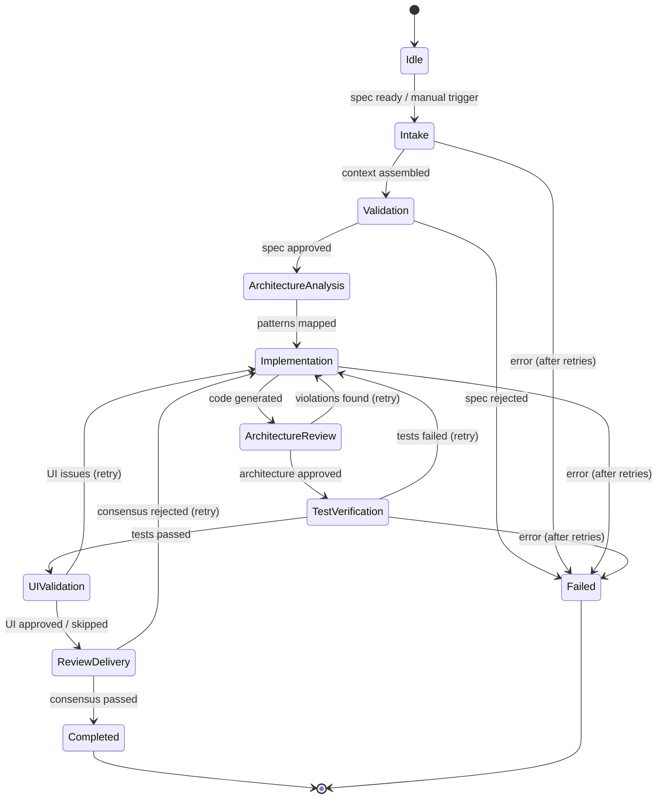
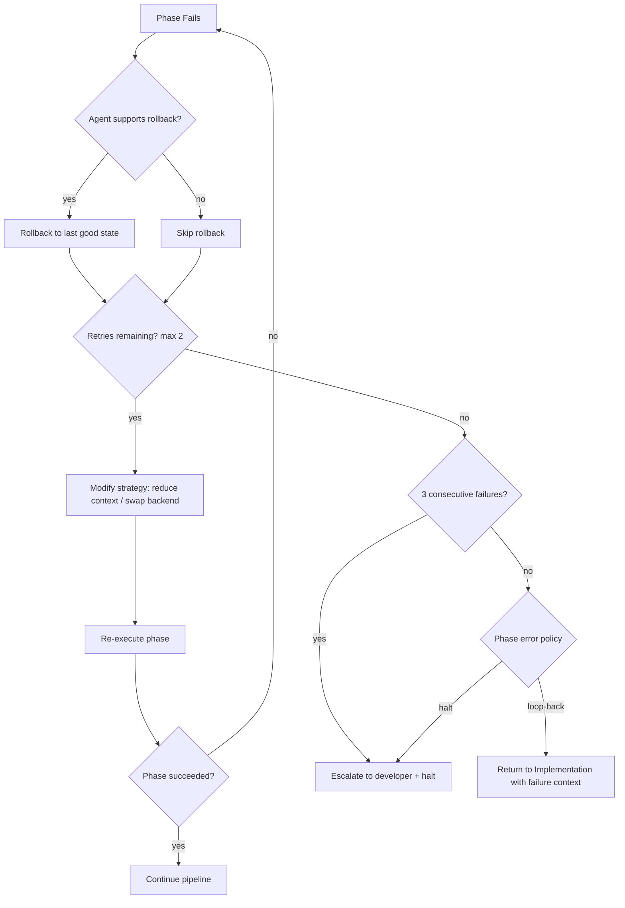

# Design Document: KASO — Kiro-Enabled Agent Swarm Orchestrator

## Overview

KASO is a locally-run Node.js/TypeScript orchestration system that reads Kiro-generated spec documents and coordinates specialized AI agents through an 8-phase development lifecycle. The system uses a hub-and-spoke architecture where a central Orchestrator dispatches work to stateless, single-responsibility agents. A pluggable executor backend layer allows swapping AI coding tools (Claude Code, Kimi Code, Codex CLI, local models) without modifying orchestration logic.

The system watches `.kiro/specs/` for specs that transition to "ready-for-dev" status, assembles execution context, validates specs, analyzes architecture alignment, delegates implementation to an AI backend, runs architecture review, generates and executes tests, performs visual regression testing on UI changes, conducts multi-perspective code review via a Review Council, and delivers a PR — all within an isolated git worktree.

Key design goals:
- Deterministic, sequential 8-phase pipeline with clear phase boundaries
- Stateless agents communicating exclusively through structured context objects
- Composition over inheritance; pure functions wherever possible
- Pluggable backends and extensible agent types via a plugin system
- Resource-conscious execution with configurable concurrency limits and cost budgets
- Real-time observability via event streaming and persisted execution history
- Crash-resilient execution with write-ahead checkpointing and automatic recovery
- Full CLI interface for controlling and inspecting all orchestration operations

## Architecture

### High-Level Architecture

```mermaid
graph TB
    subgraph Entry
        FW[File Watcher] -->|spec ready| ORCH
        CLI[CLI Interface] -->|manual trigger| ORCH
    end

    subgraph Core
        ORCH[Orchestrator]
        SM[State Machine]
        ORCH --> SM
        ORCH --> EB[Event Bus]
        ORCH --> WM[Worktree Manager]
        ORCH --> CM[Concurrency Manager]
    end

    subgraph Pipeline
        P1[Phase 1: Intake]
        P2[Phase 2: Validation]
        P3[Phase 3: Architecture Analysis]
        P4[Phase 4: Implementation]
        P5[Phase 5: Architecture Review]
        P6[Phase 6: Test & Verification]
        P7[Phase 7: UI/UX Validation]
        P8[Phase 8: Review & Delivery]
        P1 --> P2 --> P3 --> P4 --> P5 --> P6 --> P7 --> P8
    end

    subgraph Agents
        SRA[SpecReader Agent]
        SVA[SpecValidator Agent]
        AGA[ArchitectureGuardian Agent]
        EXA[Executor Agent]
        TEA[TestEngineer Agent]
        UVA[UIValidator Agent]
        RCA[Review Council]
        DA[Delivery Agent]
    end

    subgraph Infrastructure
        EB2[Event Bus / SSE]
        STORE[Execution Store - SQLite/JSONL]
        CRED[Credential Manager]
        COST[Cost Tracker]
        WH[Webhook Dispatcher]
        PLUG[Plugin Loader]
        MCP[MCP Client]
    end

    SM -->|dispatch| Agents
    Agents -->|AgentResult| SM
    EB --> EB2
    EB --> WH
    ORCH --> STORE
    ORCH --> COST
    EXA --> BACKEND[Executor Backend Adapter]
    BACKEND --> EXT_AI[External AI Tool]
```



### Execution Flow



### Module Organization

```
src/
├── core/
│   ├── orchestrator.ts          # Central hub, pipeline execution
│   ├── state-machine.ts         # Phase transitions, execution state
│   ├── event-bus.ts             # Internal pub/sub for real-time events
│   ├── concurrency-manager.ts   # Agent execution slot management
│   └── types.ts                 # Core type definitions
├── agents/
│   ├── agent-interface.ts       # Agent contract definition
│   ├── agent-registry.ts        # Agent registration and validation
│   ├── spec-reader.ts           # Phase 1: Intake
│   ├── spec-validator.ts        # Phase 2: Validation
│   ├── architecture-guardian.ts # Phase 3 & 5: Architecture
│   ├── executor.ts              # Phase 4: Implementation
│   ├── test-engineer.ts         # Phase 6: Test & Verification
│   ├── ui-validator.ts          # Phase 7: UI/UX Validation
│   ├── review-council.ts        # Phase 8: Review Council
│   └── delivery.ts              # Phase 8: PR Delivery
├── backends/
│   ├── backend-adapter.ts       # Executor backend interface
│   ├── backend-registry.ts      # Backend discovery and selection
│   └── backend-process.ts       # Subprocess management for backends
├── infrastructure/
│   ├── file-watcher.ts          # Spec directory monitoring
│   ├── worktree-manager.ts      # Git worktree lifecycle
│   ├── credential-manager.ts    # Env var / keychain credential loading
│   ├── execution-store.ts       # SQLite/JSONL persistence
│   ├── checkpoint-manager.ts    # Write-ahead checkpointing for crash recovery
│   ├── cost-tracker.ts          # Token usage and cost accumulation
│   ├── webhook-dispatcher.ts    # Outbound webhook delivery
│   ├── mcp-client.ts            # MCP server connection management
│   └── log-redactor.ts          # Secret redaction from log output
├── plugins/
│   ├── plugin-loader.ts         # npm package discovery and loading
│   └── phase-injector.ts        # Custom phase insertion logic
├── cli/
│   ├── index.ts                 # CLI entry point
│   └── commands.ts              # start, status, pause, resume, cancel, cost, history, logs, watch
├── streaming/
│   └── sse-server.ts            # SSE/WebSocket event streaming
└── config/
    ├── schema.ts                # Configuration schema and validation
    └── loader.ts                # Config file loading and defaults
```


## Components and Interfaces

### Agent Interface Contract

The foundational contract all agents must implement. This is the single extension point for the plugin system.

```typescript
interface Agent {
  readonly name: string;
  readonly phase: PhaseName;

  execute(context: AgentContext): Promise<AgentResult>;
  supportsRollback(): boolean;
  estimatedDuration(): number; // milliseconds
  requiredContext(): ReadonlyArray<string>;
}
```

### Agent Registry

Validates and stores agent implementations. Enforces the interface contract at registration time.

```typescript
interface AgentRegistry {
  register(agent: Agent): RegistrationResult;
  getAgentForPhase(phase: PhaseName): Agent;
  listRegistered(): ReadonlyArray<AgentRegistration>;
}

interface RegistrationResult {
  readonly success: boolean;
  readonly errors: ReadonlyArray<string>;
}

interface AgentRegistration {
  readonly name: string;
  readonly phase: PhaseName;
  readonly supportsRollback: boolean;
}
```

### Orchestrator

The central hub that drives the pipeline. Owns the state machine, dispatches to agents, and coordinates infrastructure.

```typescript
interface Orchestrator {
  startRun(specPath: string): Promise<ExecutionRun>;
  pauseRun(runId: string): Promise<void>;
  resumeRun(runId: string): Promise<void>;
  cancelRun(runId: string): Promise<void>;
  getRunStatus(runId: string): ExecutionRunStatus;
  onEvent(handler: (event: ExecutionEvent) => void): void;
  queueSpecUpdate(specPath: string): void; // queues re-run after current run completes
  recoverInterruptedRuns(): Promise<ReadonlyArray<string>>; // returns recovered runIds
}
```

### State Machine

Manages phase transitions and enforces the sequential pipeline with retry/rollback loops.

```typescript
interface StateMachine {
  readonly currentPhase: PhaseName;
  readonly status: RunStatus;

  transition(result: PhaseResult): PhaseTransition;
  canTransition(to: PhaseName): boolean;
  getHistory(): ReadonlyArray<PhaseTransition>;
}

interface PhaseTransition {
  readonly from: PhaseName;
  readonly to: PhaseName;
  readonly timestamp: Date;
  readonly trigger: 'success' | 'failure' | 'skip' | 'retry';
}
```

### Executor Backend Adapter

The abstraction layer for pluggable AI coding tools.

```typescript
interface ExecutorBackend {
  readonly name: string;
  readonly protocol: BackendProtocol;
  readonly maxContextWindow: number;
  readonly costPer1000Tokens: number;

  execute(request: BackendRequest): Promise<BackendResponse>;
  isAvailable(): Promise<boolean>;
  onProgress(handler: (event: ProgressEvent) => void): void;
}

interface BackendRequest {
  readonly prompt: string;
  readonly context: string;
  readonly mcpTools?: ReadonlyArray<MCPToolDefinition>;
  readonly workingDirectory: string;
}

interface BackendResponse {
  readonly output: string;
  readonly tokensUsed: number;
  readonly modifiedFiles: ReadonlyArray<string>;
  readonly exitCode: number;
}

/** NDJSON progress event emitted by executor backends on stdout (one JSON object per line) */
interface BackendProgressEvent {
  readonly type: 'file_modified' | 'test_run' | 'status' | 'error' | 'log';
  readonly timestamp: string; // ISO 8601
  readonly message?: string;
  readonly data?: Record<string, unknown>;
}

// Backend protocol mapping:
// Kimi Code = 'acp', Claude Code = 'acp', Codex CLI = 'cli-json', Local models = 'cli-stdout'
type BackendProtocol = 'cli-stdout' | 'cli-json' | 'acp' | 'mcp';
```

### Event Bus

Internal pub/sub for decoupled real-time event propagation.

```typescript
interface EventBus {
  emit(event: ExecutionEvent): void;
  on(eventType: EventType, handler: (event: ExecutionEvent) => void): Unsubscribe;
  onAny(handler: (event: ExecutionEvent) => void): Unsubscribe;
}

type Unsubscribe = () => void;

type EventType =
  | 'run:started'
  | 'run:completed'
  | 'run:failed'
  | 'run:cancelled'
  | 'run:budget_exceeded'
  | 'run:recovered'
  | 'phase:started'
  | 'phase:completed'
  | 'phase:failed'
  | 'phase:skipped'
  | 'phase:timeout'
  | 'agent:progress'
  | 'agent:log';
```

### Worktree Manager

Handles git worktree lifecycle — creation, path resolution, cleanup.

```typescript
interface WorktreeManager {
  create(specName: string, baseBranch: string): Promise<WorktreeInfo>; // branch: kaso/[specName]-[YYYYMMDDTHHmmss]
  getPath(runId: string): string;
  push(runId: string, remote: string): Promise<void>;
  cleanup(runId: string): Promise<void>;
  retain(runId: string): void; // mark for manual inspection
  exists(runId: string): boolean; // check worktree still exists (for crash recovery)
  isConsistent(runId: string): Promise<boolean>; // verify worktree git state is valid
}

interface WorktreeInfo {
  readonly path: string;
  readonly branch: string; // format: kaso/[feature-name]-[YYYYMMDDTHHmmss]
  readonly runId: string;
}
```

### Credential Manager

Loads secrets from environment variables or OS keychain. Never from git-tracked files.

```typescript
interface CredentialManager {
  getApiKey(keyName: string): string; // throws if missing
  listRequiredKeys(): ReadonlyArray<string>;
  validateAllPresent(): ValidationResult;
  redact(text: string): string;
}
```

### Concurrency Manager

Controls parallel agent execution based on system resources.

```typescript
interface ConcurrencyManager {
  readonly maxSlots: number;
  readonly activeCount: number;

  acquire(): Promise<ConcurrencySlot>;
  release(slot: ConcurrencySlot): void;
  configure(maxConcurrent: number): void;
}

interface ConcurrencySlot {
  readonly id: string;
  readonly acquiredAt: Date;
}
```

### Plugin Loader

Discovers and loads custom agents from npm packages.

```typescript
interface PluginLoader {
  loadPlugins(config: PluginConfig): Promise<ReadonlyArray<LoadedPlugin>>;
  validatePlugin(plugin: unknown): PluginValidationResult;
}

interface LoadedPlugin {
  readonly packageName: string;
  readonly agent: Agent;
  readonly version: string;
}

interface PluginValidationResult {
  readonly valid: boolean;
  readonly errors: ReadonlyArray<string>;
}
```

### Webhook Dispatcher

Delivers execution lifecycle events to configured external URLs. When a secret is configured, payloads are signed using HMAC-SHA256 and the signature is sent in the `X-KASO-Signature` header. Custom headers from the config are included in every request for auth integration (Bearer tokens, API keys, etc.).

```typescript
interface WebhookDispatcher {
  dispatch(event: WebhookEvent): Promise<void>;
  configure(webhooks: ReadonlyArray<WebhookConfig>): void;
}

interface WebhookConfig {
  readonly url: string;
  readonly events: ReadonlyArray<EventType>;
  /** HMAC-SHA256 secret for signing webhook payloads. Signature sent in X-KASO-Signature header. */
  readonly secret?: string;
  /** Custom headers for webhook authentication (e.g., Bearer tokens, API keys) */
  readonly headers?: Record<string, string>;
}

interface WebhookEvent {
  readonly type: EventType;
  readonly specName: string;
  readonly phaseName: PhaseName;
  readonly timestamp: Date;
  readonly payload: Record<string, unknown>;
}
```

### Cost Tracker

Accumulates token usage and cost estimates per execution run.

```typescript
interface CostTracker {
  recordInvocation(runId: string, backendName: string, tokensUsed: number, costPer1000: number): void;
  getRunCost(runId: string): CostSummary;
  getHistoricalCosts(filter?: CostFilter): ReadonlyArray<CostSummary>;
  checkBudget(runId: string, budget: number): BudgetCheckResult;
}

interface BudgetCheckResult {
  readonly withinBudget: boolean;
  readonly currentCost: number;
  readonly budget: number;
  readonly remainingBudget: number;
}

interface CostSummary {
  readonly runId: string;
  readonly totalTokens: number;
  readonly estimatedCost: number;
  readonly breakdownByBackend: ReadonlyArray<BackendCostEntry>;
}

interface BackendCostEntry {
  readonly backendName: string;
  readonly tokens: number;
  readonly cost: number;
  readonly invocationCount: number;
}
```

### Execution Store

Persists execution run history and phase outputs.

```typescript
interface ExecutionStore {
  saveRun(run: ExecutionRunRecord): Promise<void>;
  getRun(runId: string): Promise<ExecutionRunRecord | null>;
  listRuns(filter?: RunFilter): Promise<ReadonlyArray<ExecutionRunRecord>>;
  appendPhaseResult(runId: string, result: PhaseResultRecord): Promise<void>;
  getInterruptedRuns(): Promise<ReadonlyArray<ExecutionRunRecord>>; // runs in non-terminal state
  updateRunStatus(runId: string, status: RunStatus): Promise<void>;
  checkpoint(runId: string, state: ExecutionCheckpoint): Promise<void>; // write-ahead persistence
}

/** Checkpoint written before each phase transition for crash recovery */
interface ExecutionCheckpoint {
  readonly runId: string;
  readonly lastCompletedPhase: PhaseName;
  readonly nextPhase: PhaseName;
  readonly accumulatedOutputs: ReadonlyArray<PhaseResultRecord>;
  readonly costSoFar: CostSummary;
  readonly worktreePath: string;
  readonly timestamp: Date;
}

interface ExecutionRunRecord {
  readonly runId: string;
  readonly specName: string;
  readonly specPath: string;
  readonly status: RunStatus;
  readonly startedAt: Date;
  readonly completedAt?: Date;
  readonly phases: ReadonlyArray<PhaseResultRecord>;
  readonly cost: CostSummary;
}
```

### MCP Client

Manages connections to configured MCP servers and exposes tool capabilities.

```typescript
interface MCPClient {
  connect(config: MCPServerConfig): Promise<void>;
  disconnect(serverName: string): Promise<void>;
  listTools(): ReadonlyArray<MCPToolDefinition>;
  invokeTool(toolName: string, args: Record<string, unknown>): Promise<MCPToolResult>;
}

interface MCPServerConfig {
  readonly name: string;
  readonly command: string;
  readonly args: ReadonlyArray<string>;
  readonly env?: Record<string, string>;
}

interface MCPToolDefinition {
  readonly name: string;
  readonly description: string;
  readonly inputSchema: Record<string, unknown>;
}
```

### CLI Interface

Provides the developer-facing command-line interface for all KASO operations.

```typescript
interface CLIHandler {
  start(specPath: string): Promise<void>;
  status(runId?: string): Promise<void>;
  pause(runId: string): Promise<void>;
  resume(runId: string): Promise<void>;
  cancel(runId: string): Promise<void>;
  cost(runId?: string): Promise<void>;
  history(options: { limit?: number }): Promise<void>;
  logs(runId: string, options: { phase?: PhaseName }): Promise<void>;
  watch(): Promise<void>;
}
```

### Checkpoint Manager

Handles write-ahead checkpointing for crash recovery. Ensures no completed phase output is lost on unexpected termination.

```typescript
interface CheckpointManager {
  saveCheckpoint(checkpoint: ExecutionCheckpoint): Promise<void>;
  getLatestCheckpoint(runId: string): Promise<ExecutionCheckpoint | null>;
  clearCheckpoints(runId: string): Promise<void>;
}
```


## Data Models

### AgentContext

The structured data object assembled during Intake and enriched through each phase. This is the primary input to every agent.

```typescript
interface AgentContext {
  readonly runId: string;
  readonly spec: ParsedSpec;
  readonly steeringFiles: SteeringFiles;
  readonly architectureContext?: ArchitectureContext;
  readonly validationReport?: ValidationReport;
  readonly implementationResult?: ImplementationResult;
  readonly testReport?: TestReport;
  readonly uiReview?: UIReview;
  readonly mcpTools: ReadonlyArray<MCPToolDefinition>;
  readonly executorBackend: ExecutorBackendConfig;
  readonly worktreePath: string;
  readonly maxContextWindowTokens: number;
}

interface ParsedSpec {
  readonly featureName: string;
  readonly specPath: string;
  readonly design: ParsedMarkdown;
  readonly techSpec: ParsedMarkdown;
  readonly tasks: ReadonlyArray<TaskItem>;
  readonly rawFiles: Record<string, string>;
}

interface ParsedMarkdown {
  readonly raw: string;
  readonly sections: ReadonlyArray<MarkdownSection>;
  readonly codeBlocks: ReadonlyArray<CodeBlock>;
  readonly metadata: Record<string, string>;
}

interface MarkdownSection {
  readonly heading: string;
  readonly level: number;
  readonly content: string;
  readonly children: ReadonlyArray<MarkdownSection>;
}

interface CodeBlock {
  readonly language: string;
  readonly content: string;
  readonly lineStart: number;
  readonly lineEnd: number;
}

interface TaskItem {
  readonly id: string;
  readonly description: string;
  readonly status: 'complete' | 'incomplete';
  readonly subtasks: ReadonlyArray<TaskItem>;
}

interface SteeringFiles {
  readonly rules: ReadonlyArray<SteeringFile>;
  readonly hooks: ReadonlyArray<SteeringFile>;
}

interface SteeringFile {
  readonly path: string;
  readonly content: string;
}
```

### AgentResult

The structured response returned by every agent. Carries phase-specific output plus metadata.

```typescript
interface AgentResult {
  readonly success: boolean;
  readonly agentName: string;
  readonly phase: PhaseName;
  readonly durationMs: number;
  readonly output: PhaseOutput;
  readonly logs: ReadonlyArray<LogEntry>;
  readonly errors: ReadonlyArray<AgentError>;
}

type PhaseOutput =
  | AssembledContext
  | ValidationReport
  | ArchitectureContext
  | ImplementationResult
  | ArchitectureReview
  | TestReport
  | UIReview
  | ReviewCouncilResult
  | DeliveryResult;

interface LogEntry {
  readonly timestamp: Date;
  readonly level: 'debug' | 'info' | 'warn' | 'error';
  readonly message: string;
}

interface AgentError {
  readonly code: string;
  readonly message: string;
  readonly recoverable: boolean;
  readonly details?: Record<string, unknown>;
}
```

### Phase-Specific Output Types

```typescript
// Phase 1: Intake
interface AssembledContext {
  readonly spec: ParsedSpec;
  readonly architectureDocs: ReadonlyArray<string>;
  readonly relevantSourceFiles: ReadonlyArray<string>;
  readonly dependencies: DependencyInfo;
  readonly contextSizeTokens: number;
  /** Files removed during context capping, ordered by relevance (least relevant first) */
  readonly removedFiles: ReadonlyArray<string>;
}

interface DependencyInfo {
  readonly packageJson: Record<string, string>;
  readonly lockfileVersions: Record<string, string>;
}

// Phase 2: Validation
interface ValidationReport {
  readonly approved: boolean;
  readonly issues: ReadonlyArray<ValidationIssue>;
  readonly suggestedFixes: ReadonlyArray<string>;
}

interface ValidationIssue {
  readonly severity: 'error' | 'warning';
  readonly category: 'api-contract' | 'schema' | 'error-handling' | 'architecture-conflict';
  readonly description: string;
  readonly specReference: string;
}

// Phase 3: Architecture Analysis
interface ArchitectureContext {
  readonly patterns: ReadonlyArray<ArchitecturePattern>;
  readonly moduleBoundaries: ReadonlyArray<ModuleBoundary>;
  readonly adrs: ReadonlyArray<string>;
  readonly requirementMappings: ReadonlyArray<RequirementMapping>;
  readonly potentialViolations: ReadonlyArray<string>;
}

interface ArchitecturePattern {
  readonly name: string;
  readonly description: string;
  readonly fileGlobs: ReadonlyArray<string>;
}

interface ModuleBoundary {
  readonly module: string;
  readonly allowedImports: ReadonlyArray<string>;
  readonly forbiddenImports: ReadonlyArray<string>;
}

interface RequirementMapping {
  readonly requirementId: string;
  readonly targetModules: ReadonlyArray<string>;
}

// Phase 4: Implementation
interface ImplementationResult {
  readonly modifiedFiles: ReadonlyArray<string>;
  readonly addedTests: ReadonlyArray<string>;
  readonly durationMs: number;
  readonly retryCount: number;
}

// Phase 5: Architecture Review
interface ArchitectureReview {
  readonly approved: boolean;
  readonly violations: ReadonlyArray<ArchitectureViolation>;
}

interface ArchitectureViolation {
  readonly file: string;
  readonly rule: string;
  readonly description: string;
  readonly severity: 'error' | 'warning';
}

// Phase 6: Test & Verification
interface TestReport {
  readonly passed: boolean;
  readonly coveragePercent: number;
  readonly testFailures: ReadonlyArray<TestFailure>;
  readonly totalTests: number;
  readonly passedTests: number;
}

interface TestFailure {
  readonly testName: string;
  readonly file: string;
  readonly message: string;
  readonly stack?: string;
}

// Phase 7: UI/UX Validation
interface UIReview {
  readonly approved: boolean;
  readonly screenshots: ReadonlyArray<Screenshot>;
  readonly issues: ReadonlyArray<UIIssue>;
  readonly baselineStatus: BaselineStatus;
}

type BaselineStatus = 'created' | 'compared' | 'updated';

interface Screenshot {
  readonly route: string;
  readonly path: string;
  readonly baselinePath?: string;
  readonly diffPercent?: number;
  readonly isNewBaseline: boolean;
}

interface UIIssue {
  readonly category: 'visual-regression' | 'responsive' | 'accessibility';
  readonly description: string;
  readonly screenshot: string;
  readonly severity: 'error' | 'warning';
}

// Phase 8: Review & Delivery
interface ReviewCouncilResult {
  readonly consensus: ReviewConsensus;
  readonly reviews: ReadonlyArray<ReviewerVote>;
}

type ReviewConsensus = 'passed' | 'passed-with-warnings' | 'rejected';

interface ReviewerVote {
  readonly perspective: 'security' | 'performance' | 'maintainability';
  readonly approved: boolean;
  readonly comments: ReadonlyArray<string>;
}

interface DeliveryResult {
  readonly branchName: string;
  readonly commitShas: ReadonlyArray<string>;
  readonly pullRequestUrl: string;
  readonly executionSummary: string;
}
```

### Pipeline and Execution State

```typescript
type PhaseName =
  | 'intake'
  | 'validation'
  | 'architecture-analysis'
  | 'implementation'
  | 'architecture-review'
  | 'test-verification'
  | 'ui-validation'
  | 'review-delivery';

type RunStatus =
  | 'pending'
  | 'running'
  | 'paused'
  | 'completed'
  | 'failed'
  | 'cancelled';

interface ExecutionRunStatus {
  readonly runId: string;
  readonly specName: string;
  readonly status: RunStatus;
  readonly currentPhase: PhaseName;
  readonly elapsedMs: number;
  readonly phaseResults: ReadonlyArray<PhaseResultRecord>;
  readonly cost: CostSummary;
  readonly queuedSpecUpdate?: string; // path to queued spec update, if any
}

interface PhaseResultRecord {
  readonly phase: PhaseName;
  readonly status: 'success' | 'failure' | 'skipped' | 'timeout';
  readonly durationMs: number;
  readonly retryCount: number;
  readonly output?: PhaseOutput;
  readonly error?: AgentError;
  readonly timedOut?: boolean;
}

interface PhaseResult {
  readonly phase: PhaseName;
  readonly success: boolean;
  readonly output: PhaseOutput;
  readonly errors: ReadonlyArray<AgentError>;
}
```

### Configuration

```typescript
interface KASOConfig {
  readonly executorBackends: ReadonlyArray<ExecutorBackendConfig>;
  readonly defaultBackend: string;
  readonly backendSelectionStrategy: 'default' | 'context-aware';
  readonly maxConcurrentAgents: number | 'auto';
  readonly maxPhaseRetries: number;
  readonly webhooks: ReadonlyArray<WebhookConfig>;
  readonly mcpServers: ReadonlyArray<MCPServerConfig>;
  readonly plugins: ReadonlyArray<PluginConfig>;
  readonly customPhases: ReadonlyArray<CustomPhaseConfig>;
  readonly executionStore: 'sqlite' | 'jsonl';
  readonly executionStorePath: string;
  readonly costBudgetPerRun?: number; // max estimated cost in USD; halt if exceeded
  readonly phaseTimeouts: Record<PhaseName, number>; // per-phase timeout in seconds
  readonly defaultPhaseTimeout: number; // default 300 seconds
  readonly contextCapping: ContextCappingStrategy;
  readonly reviewCouncil: ReviewCouncilConfig;
  readonly uiBaseline: UIBaselineConfig;
}

interface ExecutorBackendConfig {
  readonly name: string;
  readonly command: string;
  readonly args: ReadonlyArray<string>;
  readonly protocol: BackendProtocol;
  readonly maxContextWindow: number;
  readonly costPer1000Tokens: number;
}

interface PluginConfig {
  readonly packageName: string;
  readonly config?: Record<string, unknown>;
}

interface CustomPhaseConfig {
  readonly name: string;
  readonly agentPackage: string;
  readonly insertAfter: PhaseName;
}

/** Controls how assembled context is trimmed to fit the executor backend's context window */
interface ContextCappingStrategy {
  /** Character-to-token ratio for estimation (default: 4 chars per token) */
  readonly charsPerToken: number;
  /** Priority order for removal when context exceeds limit: least-relevant source files are removed first.
   *  If spec + architecture docs alone exceed the window, an error is thrown (minimum required context cannot fit). */
  readonly removalOrder: 'relevance-ranked';
}

/** Cost control for the Review Council phase */
interface ReviewCouncilConfig {
  /** Maximum review rounds before forcing a decision (default: 2) */
  readonly maxReviewRounds: number;
  /** Whether to run reviewer instances in parallel (default: true) */
  readonly enableParallelReview: boolean;
  /** Optional cost cap in USD for the entire review phase */
  readonly reviewBudgetUsd?: number;
}

/** Configuration for UI baseline screenshot storage */
interface UIBaselineConfig {
  /** Directory for storing baseline screenshots (default: '.kaso/baselines/') */
  readonly baselineDir: string;
  /** Version control strategy for baseline images */
  readonly versionControl: 'git' | 'lfs' | 'none';
}
```

### Execution Events

```typescript
interface ExecutionEvent {
  readonly id: string;
  readonly type: EventType;
  readonly runId: string;
  readonly timestamp: Date;
  readonly phase?: PhaseName;
  readonly agentName?: string;
  readonly message: string;
  readonly data?: Record<string, unknown>;
}
```


## Correctness Properties

*A property is a characteristic or behavior that should hold true across all valid executions of a system — essentially, a formal statement about what the system should do. Properties serve as the bridge between human-readable specifications and machine-verifiable correctness guarantees.*

### Property 1: Spec parsing produces structured context

*For any* valid spec directory containing design.md, tech-spec.md, and task.md files with arbitrary markdown content, parsing the spec SHALL produce an AgentContext object containing structured representations of all three files with their markdown structure, code blocks, and metadata preserved.

**Validates: Requirements 1.1, 1.3, 8.1**

### Property 2: Missing spec files are identified by name

*For any* spec directory missing one or more of the required files (design.md, tech-spec.md, task.md), the SpecReader_Agent SHALL return an error whose missing file list is exactly the set of files not present in the directory.

**Validates: Requirements 1.2**

### Property 3: Task checkbox parsing preserves status

*For any* task.md file containing checkbox-style items (`- [x]` or `- [ ]`) with arbitrary descriptions and nesting, parsing SHALL produce TaskItem objects where each item's status matches its checkbox state (checked = complete, unchecked = incomplete).

**Validates: Requirements 1.4**

### Property 4: No concurrent runs for the same spec

*For any* spec with an active Execution_Run in a non-terminal status (running, paused), attempting to start a new Execution_Run for that same spec SHALL be rejected.

**Validates: Requirements 2.3**

### Property 5: Run outcome updates spec status

*For any* Execution_Run that transitions to a terminal state (completed, failed, cancelled), the associated spec's status SHALL be updated to reflect that terminal state.

**Validates: Requirements 2.4**

### Property 6: Phase transitions produce timestamped logs and status updates

*For any* phase transition within an Execution_Run, the orchestrator SHALL append a log entry with a valid timestamp to the spec directory AND update the spec status to reflect the current phase name.

**Validates: Requirements 3.1, 3.2**

### Property 7: Steering files propagate to all agent contexts

*For any* execution run where steering files exist in .kiro/rules/ and/or .kiro/hooks/, every AgentContext passed to every agent during that run SHALL contain the full content of all loaded steering files.

**Validates: Requirements 4.1, 4.2**

### Property 8: Agent registration validates interface completeness

*For any* object submitted for agent registration, the registry SHALL accept it if and only if it implements all four required methods (execute, supportsRollback, estimatedDuration, requiredContext) with correct signatures. Objects missing any method SHALL be rejected with an error identifying the missing methods.

**Validates: Requirements 5.5, 22.3**

### Property 9: Pipeline executes phases in sequential order

*For any* successful Execution_Run, the recorded phase execution history SHALL follow the order: Intake → Validation → Architecture Analysis → Implementation → Architecture Review → Test & Verification → UI/UX Validation → Review & Delivery, with custom phases inserted at their configured positions.

**Validates: Requirements 6.1, 23.1**

### Property 10: Phase output flows to next phase context

*For any* successful phase transition, the next phase's AgentContext SHALL contain the output of all previously completed phases.

**Validates: Requirements 6.2, 23.2**

### Property 11: Failing phase results trigger appropriate pipeline response

*For any* phase that produces a failing result (approved=false, passed=false, or consensus=rejected), the orchestrator SHALL either retry the phase, loop the pipeline back to the Implementation phase with failure context, or halt the pipeline — according to the phase's defined error policy.

**Validates: Requirements 6.3, 9.6, 12.4, 13.5, 15.5**

### Property 12: Execution run state is always tracked

*For any* active Execution_Run, the orchestrator SHALL maintain and expose the current phase name, elapsed time, accumulated phase outputs, active agent identifier, and per-phase duration and outcome metrics.

**Validates: Requirements 6.4, 17.2, 17.4**

### Property 13: Backend config round-trip

*For any* valid KASO configuration JSON containing executor backend definitions with command, arguments, protocol, maxContextWindow, and costPer1000Tokens fields, loading and re-serializing the config SHALL produce an equivalent configuration.

**Validates: Requirements 7.1, 7.3**

### Property 14: Context-aware backend selection picks cheapest fitting backend

*For any* set of executor backends and any context size, when context-aware selection is enabled, the selected backend SHALL be the one with the lowest costPer1000Tokens whose maxContextWindow is greater than or equal to the context size. If no backend fits, an error SHALL be returned.

**Validates: Requirements 7.4**

### Property 15: Assembled context respects max context window

*For any* assembled AgentContext and any configured maximum context window size, the SpecReader_Agent SHALL estimate token count using the configured charsPerToken ratio and remove least-relevant source files first until the context fits. If the spec and architecture docs alone exceed the context window, the agent SHALL throw an error indicating minimum required context cannot fit.

**Validates: Requirements 8.5**

### Property 16: Dependency info included in context

*For any* project with a package.json file, the assembled AgentContext SHALL contain dependency names and versions from that file.

**Validates: Requirements 8.4**

### Property 17: Validation output conforms to ValidationReport schema

*For any* invocation of the SpecValidator_Agent, the output SHALL be a ValidationReport containing an approved boolean, an array of ValidationIssue objects, and an array of suggested fix strings.

**Validates: Requirements 9.5**

### Property 18: ADRs are loaded when present

*For any* repository containing architectural decision record files, the ArchitectureGuardian_Agent SHALL include those ADRs in the produced ArchitectureContext.

**Validates: Requirements 10.3**

### Property 19: Implementation context includes spec, architecture, and validation

*For any* Implementation phase invocation, the agent's input context SHALL contain the parsed Spec, the ArchitectureContext from Phase 3, and the ValidationReport from Phase 2.

**Validates: Requirements 11.1**

### Property 20: Executor retries capped at 3

*For any* sequence of test failures reported by the Executor_Backend during implementation, the Executor_Agent SHALL re-invoke the backend with failure context no more than 3 times before reporting failure.

**Validates: Requirements 11.3**

### Property 21: All file modifications confined to worktree

*For any* file write, create, or modify operation performed by any agent during an Execution_Run, the file path SHALL be within the run's git worktree directory and never within the main working directory.

**Validates: Requirements 11.6, 19.2**

### Property 22: Architecture review covers all modified files

*For any* set of files modified during the Implementation phase, the Architecture Review phase SHALL review every file in that set against the ArchitectureContext patterns.

**Validates: Requirements 12.1**

### Property 23: Test generation covers all modified files

*For any* set of files modified during the Implementation phase, the TestEngineer_Agent SHALL generate tests targeting every file in that set.

**Validates: Requirements 13.1**

### Property 24: TestReport conforms to schema

*For any* invocation of the TestEngineer_Agent, the output SHALL be a TestReport containing a passed boolean, a coveragePercent number, and an array of TestFailure objects.

**Validates: Requirements 13.4**

### Property 25: UI phase skipped for non-UI specs

*For any* spec that does not reference UI components or routes, the orchestrator SHALL skip the UI/UX Validation phase and transition directly to Review & Delivery.

**Validates: Requirements 14.6**

### Property 26: UIReview conforms to schema

*For any* invocation of the UIValidator_Agent, the output SHALL be a UIReview containing an approved boolean, an array of Screenshot objects, and an array of UIIssue objects.

**Validates: Requirements 14.5**

### Property 27: Review Council spawns 3 perspective-specific reviewers and collects all votes

*For any* Review Council invocation, exactly 3 reviewer instances SHALL be spawned with perspectives [security, performance, maintainability], and exactly 3 votes SHALL be collected.

**Validates: Requirements 15.1, 15.2**

### Property 28: Review consensus determined by approval count

*For any* set of 3 reviewer votes, the Review_Consensus SHALL be: "passed" if 3 approve, "passed-with-warnings" if exactly 2 approve (with the dissenting review included), and "rejected" if fewer than 2 approve.

**Validates: Requirements 15.3, 15.4, 15.5**

### Property 29: Conventional commit format

*For any* commit created by the DeliveryAgent, the commit message SHALL match the conventional commit format pattern: `^(feat|fix|refactor|test|docs)(\(.+\))?: .+`

**Validates: Requirements 15.7**

### Property 30: PR contains required sections

*For any* pull request created by the DeliveryAgent, the PR body SHALL contain an execution summary, test results, and review council outcome.

**Validates: Requirements 15.8**

### Property 31: Rollback triggered for rollback-capable agents on failure

*For any* phase failure where the executing agent reports supportsRollback() as true, the orchestrator SHALL invoke rollback to restore the last known good state before retrying.

**Validates: Requirements 16.1**

### Property 32: Phase retry capped at 2 additional attempts

*For any* phase failure, the orchestrator SHALL retry with a modified strategy (reduced context window or alternative backend) no more than 2 additional times before escalating.

**Validates: Requirements 16.2**

### Property 33: Three consecutive failures trigger escalation

*For any* Execution_Run where 3 consecutive phase failures occur, the orchestrator SHALL escalate to the developer with a failure report and halt the pipeline.

**Validates: Requirements 16.3**

### Property 34: Security concerns trigger immediate escalation

*For any* agent that detects a security concern in generated code, the orchestrator SHALL immediately escalate to the developer and halt the pipeline, regardless of retry budget.

**Validates: Requirements 16.5**

### Property 35: Worktree preserved on halt or cancel

*For any* Execution_Run that is cancelled or fails permanently, the git worktree and all phase outputs SHALL be preserved (not cleaned up) and the worktree path SHALL be logged.

**Validates: Requirements 16.6, 19.4**

### Property 36: Secret redaction in logs

*For any* log output or streamed event, all known API keys and secret values SHALL be redacted — the raw secret string SHALL not appear in the output.

**Validates: Requirements 20.2**

### Property 37: Credentials loaded only from secure sources

*For any* credential loading operation, the source SHALL be environment variables or OS keychain. No git-tracked file SHALL be read as a credential source.

**Validates: Requirements 20.1**

### Property 38: Concurrency limit enforced

*For any* state where the number of concurrently executing agents equals the configured maximum, additional agent execution requests SHALL be queued until a slot is released.

**Validates: Requirements 21.1, 21.3**

### Property 39: Execution history round-trip

*For any* completed Execution_Run, saving the run to the execution store and then retrieving it by runId SHALL produce an equivalent record.

**Validates: Requirements 17.5**

### Property 40: Pause then resume continues from correct phase

*For any* running Execution_Run, issuing a pause command SHALL allow the current phase to complete and halt before the next phase. Issuing a resume command SHALL continue execution from the next pending phase.

**Validates: Requirements 18.1, 18.2**

### Property 41: Cancel marks run as cancelled and preserves state

*For any* running Execution_Run, issuing a cancel command SHALL terminate the active agent, mark the run as cancelled, and preserve the worktree state.

**Validates: Requirements 18.3**

### Property 42: Worktree branch name derived from spec feature name

*For any* Execution_Run, the created git worktree's branch name SHALL follow the format `kaso/[feature-name]-[YYYYMMDDTHHmmss]` where feature-name is the spec's feature name and the timestamp is the worktree creation time.

**Validates: Requirements 19.1**

### Property 43: Custom phase error handling matches built-in phases

*For any* custom phase that fails, the orchestrator SHALL apply the same retry, rollback, and escalation logic as built-in phases.

**Validates: Requirements 23.3**

### Property 44: Webhook payload contains required fields and auth headers

*For any* lifecycle event with registered webhooks, the HTTP POST payload SHALL contain the event type, spec name, phase name, and timestamp. When a secret is configured, the request SHALL include an `X-KASO-Signature` header with the HMAC-SHA256 signature. When custom headers are configured, they SHALL be included in the request.

**Validates: Requirements 24.2, 24.4**

### Property 45: Webhook retry with exponential backoff

*For any* failed webhook delivery, the orchestrator SHALL retry up to 3 times with exponential backoff between attempts.

**Validates: Requirements 24.3**

### Property 46: MCP tools scoped to Executor_Backend during Implementation only

*For any* configured MCP server, its tool definitions SHALL appear in the AgentContext. MCP tools SHALL only be passed to the Executor_Backend during the Implementation phase when the backend protocol supports MCP or ACP. All other agents (SpecValidator, ArchitectureGuardian, TestEngineer, UIValidator, ReviewCouncil) operate on static context only and SHALL NOT invoke MCP tools.

**Validates: Requirements 25.2, 25.3**

### Property 47: Cost calculation correctness

*For any* Executor_Backend invocation with a known token count and configured costPer1000Tokens rate, the calculated cost SHALL equal `(tokensUsed / 1000) * costPer1000Tokens`. The total run cost SHALL equal the sum of all individual invocation costs and SHALL be included in the run summary and persisted history.

**Validates: Requirements 26.1, 26.2, 26.3**

### Property 48: Plugin discovery loads configured plugins

*For any* KASO configuration with a plugins section listing package names, the plugin loader SHALL attempt to load each listed package and register valid agents.

**Validates: Requirements 22.2**

### Property 49: Phase timeout enforced

*For any* phase execution that exceeds its configured timeout (default 300 seconds), the orchestrator SHALL cancel the active agent, record the phase result with status "timeout", and apply the standard retry and escalation logic.

**Validates: Requirements 16.7, 16.8**

### Property 50: Spec update mid-execution is queued

*For any* spec that is modified while an Execution_Run is in progress for that spec, the orchestrator SHALL queue the updated spec for a new Execution_Run after the current run completes, rather than cancelling or interrupting the active run.

**Validates: Requirements 2.5**

### Property 51: Execution state survives process restart

*For any* Execution_Run that has completed at least one phase, if the KASO process terminates unexpectedly and restarts, the orchestrator SHALL detect the interrupted run and resume from the last completed phase with all accumulated outputs intact.

**Validates: Requirements 27.1, 27.2, 27.3**

### Property 52: Crash recovery validates worktree integrity

*For any* interrupted Execution_Run detected on startup, the orchestrator SHALL verify the associated git worktree exists and is consistent before resuming. If the worktree is missing or corrupted, the run SHALL be marked as failed.

**Validates: Requirements 27.4, 27.5**

### Property 53: CLI commands map to orchestrator operations

*For any* CLI command (start, status, pause, resume, cancel, cost, history, logs, watch), the CLI handler SHALL invoke the corresponding Orchestrator method and format the result for terminal output.

**Validates: Requirements 28.1, 28.2, 28.3, 28.4, 28.5, 28.6, 28.7, 28.8, 28.9**

### Property 54: Cost budget halts execution when exceeded

*For any* Execution_Run with a configured cost budget, when the accumulated cost exceeds the budget after an Executor_Backend invocation, the orchestrator SHALL halt the pipeline, preserve the worktree, and emit a `run:budget_exceeded` event.

**Validates: Requirements 26.5, 26.6**

### Property 55: UI baseline management lifecycle

*For any* UI/UX Validation phase where no baseline images exist for an affected route, the UIValidator_Agent SHALL create initial baselines from captured screenshots and store them under the configured UIBaselineConfig.baselineDir organized by route path. For subsequent runs, the agent SHALL diff against existing baselines. When a developer approves a UIReview with visual differences, the baselines SHALL be updated.

**Validates: Requirements 14.4, 14.5**

### Property 56: Worktree branch follows naming convention

*For any* Execution_Run, the created git worktree branch name SHALL match the pattern `kaso/[feature-name]-[YYYYMMDDTHHmmss]`.

**Validates: Requirements 19.1**

### Property 57: Backend progress events are NDJSON on stdout

*For any* Executor_Backend progress stream, each line SHALL be a valid JSON object containing at minimum a `type` field and a `timestamp` field, conforming to the BackendProgressEvent schema.

**Validates: Requirements 11.4**

### Property 58: Review council cost control

*For any* Review Council invocation with a configured ReviewCouncilConfig, the council SHALL execute no more than maxReviewRounds rounds. If reviewBudgetUsd is set and the accumulated review cost exceeds it, the council SHALL stop further rounds and return the best consensus available from completed rounds.

**Validates: Requirements 29.1, 29.2, 29.3**

### Property 59: Webhook payloads are HMAC-SHA256 signed

*For any* webhook delivery where the WebhookConfig has a secret configured, the HTTP request SHALL include an `X-KASO-Signature` header containing the HMAC-SHA256 signature of the JSON payload computed using the configured secret. Custom headers from the WebhookConfig SHALL also be included in the request.

**Validates: Requirements 24.2**

### Property 60: UI baselines stored under configured directory by route

*For any* UI baseline created or updated by the UIValidator_Agent, the baseline image SHALL be stored under the configured UIBaselineConfig.baselineDir, organized by route path (e.g., `.kaso/baselines/dashboard/index.png`).

**Validates: Requirements 14.4**

### Property 61: Context capping throws on irreducible overflow

*For any* spec where the combined token estimate of the spec files and architecture docs alone (excluding source files) exceeds the configured Executor_Backend maximum context window, the SpecReader_Agent SHALL throw an error indicating that the minimum required context cannot fit.

**Validates: Requirements 8.5**


## Error Handling

### Error Classification

Errors are classified into three tiers that determine the response strategy:

| Tier | Description | Response |
|------|-------------|----------|
| Recoverable | Transient failures (backend timeout, network blip) | Retry with modified strategy |
| Phase-Fatal | Phase cannot complete (validation rejected, tests fail) | Loop back or halt per phase policy |
| Phase-Timeout | Phase exceeds configured timeout (default 300s) | Cancel agent, treat as phase failure, retry/escalate |
| Budget-Exceeded | Accumulated cost exceeds configured budget | Immediate halt, preserve worktree |
| Run-Fatal | Unrecoverable (security concern, 3 consecutive failures, architectural deadlock) | Immediate escalation + halt |

### Phase-Level Error Handling Flow



### Phase Error Policies

| Phase | On Failure |
|-------|-----------|
| Intake | Halt — cannot proceed without context |
| Validation | Halt — report issues to developer |
| Architecture Analysis | Halt — cannot proceed without patterns |
| Implementation | Retry with modified strategy, then halt |
| Architecture Review | Loop back to Implementation with violations |
| Test & Verification | Loop back to Implementation with test failures |
| UI/UX Validation | Loop back to Implementation with UI issues |
| Review & Delivery (consensus rejected) | Loop back to Implementation with review feedback |

### Immediate Escalation Triggers

These conditions bypass normal retry logic and halt immediately:
- Security concern detected in generated code (any agent)
- Architectural deadlock detected (contradictory pattern requirements)
- 3 consecutive phase failures within a single Execution_Run
- Cost budget exceeded for the Execution_Run

### State Preservation on Failure

When the pipeline halts:
- Git worktree is retained (not cleaned up) for manual inspection
- Worktree path is logged to the execution store and streamed to clients
- All accumulated phase outputs are persisted
- The Execution_Run record is saved with status "failed" and full error details
- Write-ahead checkpoint ensures no completed phase output is lost even on unexpected process termination

### Crash Recovery

On startup, the orchestrator:
1. Queries the execution store for runs in non-terminal state (running, paused)
2. For each interrupted run, verifies the git worktree exists and is consistent
3. If worktree is valid, resumes from the last completed phase using the checkpoint
4. If worktree is missing or corrupted, marks the run as failed and reports to the developer

### Credential Errors

- Missing required API keys halt startup with a clear error naming the missing key
- Credential loading never falls back to git-tracked files
- All secrets are redacted from error messages and logs

## Testing Strategy

### Testing Framework

- Runtime: Node.js with TypeScript
- Unit/Integration Testing: Vitest
- Property-Based Testing: fast-check (via `@fast-check/vitest` integration)
- UI Testing (for UIValidator_Agent): Playwright
- Coverage: Vitest built-in coverage with v8 provider

### Dual Testing Approach

KASO uses both unit tests and property-based tests as complementary strategies:

- **Unit tests** verify specific examples, edge cases, integration points, and error conditions
- **Property-based tests** verify universal properties across randomly generated inputs (minimum 100 iterations per property)
- Together they provide comprehensive coverage — unit tests catch concrete bugs, property tests verify general correctness

### Property-Based Testing Configuration

- Library: `fast-check` (the standard PBT library for TypeScript)
- Each property test runs a minimum of 100 iterations
- Each property test is tagged with a comment referencing its design document property
- Tag format: `// Feature: kaso-orchestrator, Property {number}: {property_text}`
- Each correctness property from this design document is implemented by a single property-based test

### Test Organization

```
tests/
├── unit/
│   ├── agents/
│   │   ├── spec-reader.test.ts
│   │   ├── spec-validator.test.ts
│   │   ├── architecture-guardian.test.ts
│   │   ├── executor.test.ts
│   │   ├── test-engineer.test.ts
│   │   ├── ui-validator.test.ts
│   │   ├── review-council.test.ts
│   │   └── delivery.test.ts
│   ├── core/
│   │   ├── orchestrator.test.ts
│   │   ├── state-machine.test.ts
│   │   ├── event-bus.test.ts
│   │   └── concurrency-manager.test.ts
│   ├── backends/
│   │   ├── backend-registry.test.ts
│   │   └── backend-process.test.ts
│   └── infrastructure/
│       ├── worktree-manager.test.ts
│       ├── credential-manager.test.ts
│       ├── execution-store.test.ts
│       ├── checkpoint-manager.test.ts
│       ├── cost-tracker.test.ts
│       ├── webhook-dispatcher.test.ts
│       ├── log-redactor.test.ts
│       ├── plugin-loader.test.ts
│       └── cli-commands.test.ts
├── property/
│   ├── spec-parsing.property.test.ts       # Properties 1, 2, 3
│   ├── pipeline-ordering.property.test.ts  # Properties 9, 10, 11
│   ├── agent-registry.property.test.ts     # Property 8
│   ├── backend-selection.property.test.ts  # Properties 13, 14
│   ├── context-assembly.property.test.ts   # Properties 15, 16, 7
│   ├── review-consensus.property.test.ts   # Properties 27, 28
│   ├── cost-tracking.property.test.ts      # Property 47
│   ├── concurrency.property.test.ts        # Property 38
│   ├── error-handling.property.test.ts     # Properties 31, 32, 33, 34
│   ├── worktree-isolation.property.test.ts # Properties 21, 35, 42
│   ├── credential-security.property.test.ts # Properties 36, 37
│   ├── workflow-control.property.test.ts   # Properties 40, 41
│   ├── webhook.property.test.ts            # Properties 44, 45
│   ├── execution-store.property.test.ts    # Property 39
│   ├── delivery.property.test.ts           # Properties 29, 30
│   ├── observability.property.test.ts      # Properties 5, 6, 12
│   ├── schema-validation.property.test.ts  # Properties 17, 24, 26
│   ├── custom-phases.property.test.ts      # Properties 43
│   ├── mcp-integration.property.test.ts    # Property 46
│   ├── plugin-loading.property.test.ts     # Property 48
│   ├── phase-timeout.property.test.ts      # Property 49
│   ├── spec-update-queue.property.test.ts  # Property 50
│   ├── crash-recovery.property.test.ts     # Properties 51, 52
│   ├── cli-commands.property.test.ts       # Property 53
│   ├── cost-budget.property.test.ts        # Property 54
│   ├── ui-baseline.property.test.ts        # Property 55
│   ├── branch-naming.property.test.ts      # Property 56
│   ├── ndjson-progress.property.test.ts    # Property 57
│   ├── review-council-cost.property.test.ts # Property 58
│   ├── webhook-auth.property.test.ts       # Property 59
│   ├── ui-baseline-storage.property.test.ts # Property 60
│   └── context-capping.property.test.ts    # Property 61
    ├── full-pipeline.integration.test.ts
    ├── file-watcher.integration.test.ts
    ├── git-worktree.integration.test.ts
    └── sse-streaming.integration.test.ts
```

### Unit Test Focus Areas

- Specific examples demonstrating correct behavior for each agent
- Edge cases: empty specs, missing files, malformed markdown, zero-length task lists
- Error conditions: missing credentials, unavailable backends, network failures, phase timeouts, budget exceeded
- Integration points: agent-to-orchestrator communication, backend subprocess management
- CLI command parsing, argument validation, and output formatting
- Checkpoint persistence and crash recovery scenarios
- NDJSON progress event parsing and validation
- UI baseline creation, diffing, and approval workflows

### Property Test Focus Areas

All 61 correctness properties from this design document, covering:
- Spec parsing round-trips and structural preservation
- Pipeline ordering and phase transition correctness
- Agent registration validation
- Backend selection optimality
- Context assembly and size constraints
- Review consensus calculation
- Cost calculation arithmetic and budget enforcement
- Concurrency limit enforcement
- Error handling retry/escalation logic and phase timeouts
- Worktree isolation invariants and branch naming conventions
- Secret redaction completeness
- Workflow control (pause/resume/cancel) state transitions
- Webhook delivery and retry behavior
- Execution history persistence round-trips
- Crash recovery and state persistence
- CLI command routing
- Spec-update-mid-execution queuing
- UI baseline management lifecycle
- NDJSON progress event protocol
- Review council cost control and round limits
- Webhook HMAC-SHA256 payload signing and custom headers
- UI baseline directory organization by route
- Context capping with relevance-ranked removal and irreducible overflow errors

### Integration Test Focus Areas

- End-to-end pipeline execution with mock backends
- File watcher triggering execution runs
- Git worktree creation, isolation, and cleanup
- SSE/WebSocket event streaming to clients
- Plugin loading from npm packages
