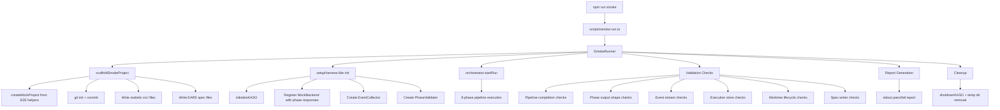

# Design Document: Real-World Smoke Run

## Overview

The smoke run is a standalone executable script (`scripts/smoke-run.ts`) that exercises KASO's full 8-phase pipeline against a scaffolded test application with realistic spec files. It reuses the existing E2E helper infrastructure (`mock-backend.ts`, `mock-project.ts`, `phase-outputs.ts`, `event-collector.ts`, `phase-validator.ts`, `harness.ts`) but wraps them in a non-Vitest runner that produces a structured pass/fail validation report to stdout.

The core module exports a `runSmoke()` function that can be:
1. Invoked directly via `npx tsx scripts/smoke-run.ts` (or `npm run smoke`)
2. Imported by a thin Vitest wrapper for CI integration

**Note:** `tsx` must be added as a devDependency (it's a zero-config TypeScript executor). The npm script will be `"smoke": "tsx scripts/smoke-run.ts"` in `package.json`.

The runner does NOT use `expect()` or test assertions. Instead, it collects validation check results into a `ValidationReport` and prints them in a human-readable format, exiting with code 0 (all pass) or 1 (any fail).

### Key Design Decisions

1. **Reuse E2E helpers** — The existing `setupHarness()` / `teardownHarness()` already wire `initializeKASO()`, register mock backends with phase responses, create event collectors, and provide phase validators. The smoke runner wraps this with git init + enhanced scaffolding + report generation.

2. **Enhanced `createMockProject` via wrapper** — Rather than modifying the shared `mock-project.ts` (which would risk breaking existing E2E tests), the smoke runner provides its own `scaffoldSmokeProject()` function that calls `createMockProject()` with richer spec content, then layers on `git init` + initial commit, `.kiro/steering/` files, and a realistic `src/` directory with actual TypeScript source files.

3. **Standalone module pattern** — `scripts/smoke-run.ts` is the entry point. The core logic lives in a `SmokeRunner` class that orchestrates setup → run → validate → report → cleanup. The class is importable for the Vitest wrapper.

4. **Validation checks as data** — Each validation is a `CheckResult` object with `name`, `passed`, `expected`, `actual`, and `description`. The runner collects all checks even after failures, so the report shows the full picture.

5. **60-second timeout** — `SmokeRunner.run()` wraps the entire execution in a `Promise.race()` with a 60-second timeout (Req 10.2). If the timeout fires, the runner aborts, cleans up, and reports a timeout failure.

6. **UI phase handling** — The smoke project's spec describes a backend API (no `.tsx`/`.html` files, no UI keywords), so the UIValidatorAgent will detect it as a non-UI spec and skip with `approved: true`. The validation checks verify `UIReview.approved === true` and accept either `uiIssues: []` or `skipped: true`.

## Architecture



## Components and Interfaces

### `CheckResult` — Individual validation check outcome

```typescript
interface CheckResult {
  /** Human-readable check name, e.g. "Pipeline status is completed" */
  name: string
  /** Whether the check passed */
  passed: boolean
  /** What was expected (for failure reporting) */
  expected?: string
  /** What was actually observed (for failure reporting) */
  actual?: string
  /** Additional context about what this check validates */
  description?: string
  /** Which requirement this check validates */
  requirement?: string
}
```

### `SmokeReport` — Aggregated validation report

```typescript
interface SmokeReport {
  /** All individual check results */
  checks: CheckResult[]
  /** Total wall-clock time in milliseconds */
  durationMs: number
  /** The runId from the pipeline execution (if it got that far) */
  runId?: string
  /** Whether all checks passed */
  allPassed: boolean
  /** Count of passed checks */
  passedCount: number
  /** Count of failed checks */
  failedCount: number
  /** Fatal error if the runner itself crashed */
  fatalError?: string
}
```

### `SmokeRunner` — Core orchestration class

```typescript
class SmokeRunner {
  private static readonly TIMEOUT_MS = 60_000

  /** Execute the full smoke run and return the report. Enforces 60s timeout (Req 10.2). */
  async run(): Promise<SmokeReport>

  /** Internal run logic, called within Promise.race() against the timeout */
  private async runInternal(): Promise<SmokeReport>

  /** Scaffold the test project with git, specs, and source files */
  private async scaffoldProject(): Promise<SmokeProjectContext>

  /** Initialize KASO and register mock backend */
  private async initializeKASO(projectCtx: SmokeProjectContext): Promise<KASOContext>

  /** Execute the pipeline via orchestrator.startRun() */
  private async executePipeline(kasoCtx: KASOContext): Promise<PipelineResult>

  /** Run all validation checks against the completed pipeline */
  private validateResults(kasoCtx: KASOContext, pipelineResult: PipelineResult): CheckResult[]

  /** Clean up all resources (worktrees, temp dirs, DB connections) */
  private async cleanup(kasoCtx: KASOContext, projectCtx: SmokeProjectContext): Promise<void>
}
```

### `scaffoldSmokeProject()` — Enhanced project scaffolding

This function creates a realistic test application that goes beyond the minimal stubs in `mock-project.ts`:

1. Calls `createMockProject()` with rich EARS-pattern spec content (3+ requirements, 6+ acceptance criteria, design doc with glossary/data model/code blocks, tasks with 2+ phases and 6+ subtasks)
2. Runs `git init` + `git add .` + `git commit` in the temp directory to create a valid git repo with a `main` branch
3. Creates `.kiro/steering/` with `coding-practices.md` (already handled by `createMockProject`)
4. Creates `src/index.ts` and `src/app.ts` with minimal but valid TypeScript source
5. Creates `tsconfig.json` in the project root

### Validation Check Categories

The runner executes checks in these groups, mapping directly to requirements:

1. **Scaffolding checks** (Req 1) — temp dir exists, has package.json, tsconfig.json, src/, .kiro/, git repo initialized
2. **Spec file checks** (Req 2) — requirements.md has EARS patterns, design.md has code blocks, tasks.md has checkbox syntax
3. **Initialization checks** (Req 3) — `initializeKASO()` returned valid ApplicationContext with all components
4. **Pipeline completion checks** (Req 4) — status is `completed`, 8 phase results, sequences 0-7
5. **Phase output checks** (Req 5) — each phase output has expected keys per interface, plus content validation: `intake.featureName` is non-empty, `intake.designDoc` has at least one section, `intake.taskList` has at least one item, `implementation.backend` matches the registered mock backend name, `review-delivery.votes` has `length >= 1`
6. **Event stream checks** (Req 6) — run:started, run:completed, 8× phase:started/completed, correct ordering
7. **Persistence checks** (Req 7) — getRun() returns completed record, getPhaseResults() returns 8 records with valid timestamps, execution-log.md and status.json written
8. **Worktree checks** (Req 8) — worktree created under .kaso/worktrees/, cleaned up after shutdown
9. **Report format checks** (Req 9) — implicitly validated by the report generation itself

### Report Format

The stdout report uses a simple text format:

```
═══════════════════════════════════════════════════
  KASO Smoke Run Report
═══════════════════════════════════════════════════

  ✓ Scaffolding: temp dir created with package.json
  ✓ Scaffolding: git repo initialized with main branch
  ✓ Scaffolding: .kiro/ directory structure exists
  ✗ Pipeline: status is completed
    Expected: completed
    Actual:   failed
    Gap:      Pipeline failed at phase 'implementation'
  ✓ Phase output: intake has featureName, designDoc, taskList
  ...

───────────────────────────────────────────────────
  Results: 28/30 passed, 2 failed
  Duration: 4.2s
  Run ID: smoke-feature-abc123
═══════════════════════════════════════════════════
```

## Data Models

### Phase Output Expected Shapes

Reuses the existing `PHASE_OUTPUT_SHAPES` from `phase-validator.ts`:

```typescript
const PHASE_OUTPUT_SHAPES: Record<string, string[]> = {
  intake: ['featureName', 'designDoc', 'taskList'],
  validation: ['approved', 'issues'],
  'architecture-analysis': ['patterns', 'moduleBoundaries', 'adrsFound'],
  implementation: ['modifiedFiles', 'addedTests', 'duration', 'backend'],
  'architecture-review': ['approved', 'violations'],
  'test-verification': ['passed', 'testsRun', 'coverage', 'duration'],
  'ui-validation': ['approved', 'uiIssues'],
  'review-delivery': ['consensus', 'votes'],
}
```

### Realistic Spec Content

The smoke runner provides spec content that exercises real parsing:

**requirements.md** — 3 requirements with 6+ acceptance criteria using EARS WHEN/THEN/SHALL patterns, a glossary, and a data model section with TypeScript interface code block.

**design.md** — Glossary, implementation details with request/response JSON schemas (2+ code blocks), data model with TypeScript interfaces, security section.

**tasks.md** — 2+ phases with checkbox syntax, 4+ top-level tasks, 6+ subtasks. Mix of `[x]` (complete) and `[ ]` (incomplete) items.

### Internal Context Types

```typescript
/** Context from project scaffolding phase */
interface SmokeProjectContext {
  projectDir: string
  specPath: string
  configPath: string
  cleanup: () => Promise<void>
}

/** Context from KASO initialization phase */
interface KASOContext {
  app: ApplicationContext
  eventCollector: EventCollector
  phaseValidator: PhaseValidator
  specPath: string
}

/** Result from pipeline execution */
interface PipelineResult {
  runId: string
  status: string
  error?: string
}
```


## Correctness Properties

*A property is a characteristic or behavior that should hold true across all valid executions of a system — essentially, a formal statement about what the system should do. Properties serve as the bridge between human-readable specifications and machine-verifiable correctness guarantees.*

### Property 1: Scaffolding completeness invariant

*For any* valid feature name string, scaffolding a smoke project SHALL produce a temporary directory containing: `package.json`, `tsconfig.json`, at least one `.ts` file under `src/`, a `.kiro/` directory with `specs/`, `steering/` subdirectories, a `kaso.config.json` that passes Zod validation, a `requirements.md` with at least 3 EARS-pattern requirements and 6 acceptance criteria, a `design.md` with at least 2 code blocks, a `tasks.md` with at least 2 phases and 6 subtasks, at least one steering file, and a git repository with at least one commit on `main`.

**Validates: Requirements 1.1, 1.2, 1.3, 2.1, 2.2, 2.3, 2.4, 3.1**

### Property 2: Phase output shape and content invariant

*For any* successfully completed pipeline run, for each of the 8 phases, the phase output stored in the ExecutionStore SHALL contain all required keys defined by that phase's output interface (e.g., intake → `featureName`, `designDoc`, `taskList`; validation → `approved`, `issues`; etc.). Additionally, `intake.featureName` SHALL be non-empty, `implementation.backend` SHALL be a non-empty string, and `review-delivery.votes` SHALL have `length >= 1`.

**Validates: Requirements 5.1, 5.2, 5.3, 5.4, 5.5, 5.6, 5.7, 5.8**

### Property 3: Event stream ordering invariant

*For any* successfully completed pipeline run, the EventBus SHALL have emitted: at least one `run:started` event, `phase:started` and `phase:completed` events for all 8 phases, and at least one `run:completed` event, with `run:started` occurring before the first `phase:started` and the last `phase:completed` occurring before `run:completed`.

**Validates: Requirements 6.1, 6.2, 6.3**

### Property 4: Persistence and sequence invariant

*For any* successfully completed pipeline run, `executionStore.getRun(runId)` SHALL return a record with status `completed` and a non-empty `worktreePath`, and `executionStore.getPhaseResults(runId)` SHALL return exactly 8 records with monotonically increasing sequence numbers (0–7) where each record has `completedAt` not before `startedAt`.

**Validates: Requirements 4.3, 4.4, 7.1, 7.2**

### Property 5: Cleanup invariant

*For any* smoke run (whether it completes successfully or fails), after the cleanup phase executes, the temporary project directory SHALL no longer exist on disk.

**Validates: Requirements 1.5**

### Property 6: Idempotence

*For any* two consecutive executions of the smoke runner with the same configuration, the set of check names and their pass/fail statuses SHALL be identical.

**Validates: Requirements 1.4, 10.4**

### Property 7: Exit code reflects report status

*For any* `SmokeReport`, the process exit code SHALL be 0 if and only if `allPassed` is true, and 1 otherwise.

**Validates: Requirements 9.3**

## Error Handling

### Initialization Failures

If `initializeKASO()` throws, the runner captures the error with full context (config path, error message, stack trace) into a `CheckResult` with `passed: false`, skips all pipeline and validation checks, and proceeds directly to cleanup and report generation. The report will show the initialization failure prominently.

### Pipeline Failures

If `orchestrator.startRun()` throws or returns a non-`completed` status, the runner:
1. Captures the failing phase name, error message, and status into a `CheckResult`
2. Still runs all validation checks that can execute (e.g., event stream checks, partial phase results)
3. Marks pipeline-dependent checks as failed with descriptive messages

### Scaffolding Failures

If `scaffoldSmokeProject()` fails (e.g., `git init` fails, temp dir creation fails), the runner captures the error, skips all subsequent phases, and reports the failure. Cleanup is best-effort since there may be partial state.

### Unhandled Exceptions

The top-level `main()` function wraps everything in a try/catch. On unhandled exception:
1. Print diagnostic message to stderr
2. Attempt cleanup of any created resources
3. Exit with code 1

### Cleanup Guarantees

Cleanup uses a finally block pattern:
- `shutdownKASO()` is always called if KASO was initialized (handles worktree cleanup)
- Temp directory removal via `rmSync(dir, { recursive: true, force: true })`
- Git branch cleanup for any `kaso/*` branches created during the run
- All cleanup operations are best-effort (errors are logged but don't prevent other cleanup steps)

## Testing Strategy

### Property-Based Tests

The feature is suitable for property-based testing. The scaffolding functions are pure-ish (given a feature name, produce a directory structure), and the validation logic maps structured data to pass/fail outcomes.

**Library**: `@fast-check/vitest` (already in devDependencies)
**Minimum iterations**: 100 per property test

Property tests will be implemented in `tests/property/smoke-run.property.test.ts`:

- **Property 1** (Scaffolding completeness): Generate random alphanumeric feature names via `fc.string()` filtered to valid kebab-case, call `scaffoldSmokeProject()`, verify all required files/dirs exist. Clean up after each iteration.
- **Property 2** (Phase output shapes): Use the existing `createDefaultPhaseResponses()` factory with randomized overrides (add extra keys, vary string values), run validation logic, verify all required keys are detected.
- **Property 5** (Cleanup): Generate random feature names, scaffold + cleanup, verify temp dir gone.
- **Property 7** (Exit code mapping): Generate random `SmokeReport` objects with varying `allPassed` values, verify exit code mapping.

Properties 3, 4, and 6 require full pipeline execution and are better suited to integration-level testing (they exercise the orchestrator, which is already thoroughly tested by E2E tier1 tests). These will be covered by the smoke run itself acting as its own integration test.

### Unit Tests

Unit tests in `tests/smoke/smoke-runner.unit.test.ts`:

- `scaffoldSmokeProject()` creates all required files and directories
- `scaffoldSmokeProject()` initializes git with main branch and at least one commit
- Report formatting produces correct output for all-pass and mixed-pass/fail scenarios
- `CheckResult` failure includes expected, actual, and description
- Cleanup removes temp directory even when pipeline failed
- Invalid config produces descriptive error in report

### Integration Test (Vitest Wrapper)

A thin Vitest wrapper in `tests/smoke/smoke-run.integration.test.ts`:

```typescript
import { SmokeRunner } from '../../scripts/smoke-run'

describe('Smoke Run Integration', () => {
  it('should complete with all checks passing', async () => {
    const runner = new SmokeRunner()
    const report = await runner.run()
    expect(report.allPassed).toBe(true)
    expect(report.failedCount).toBe(0)
  }, 60000)
})
```

This gives CI a way to run the smoke test as part of the regular test suite while the standalone script serves developers running `npm run smoke`.
