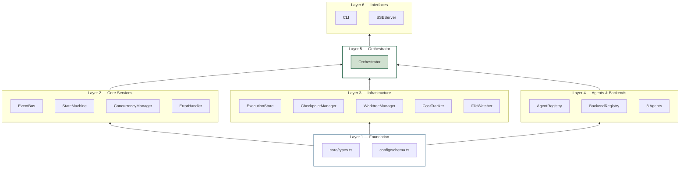
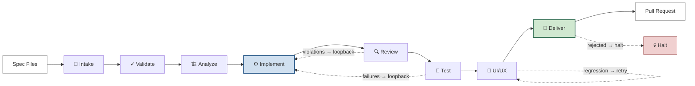
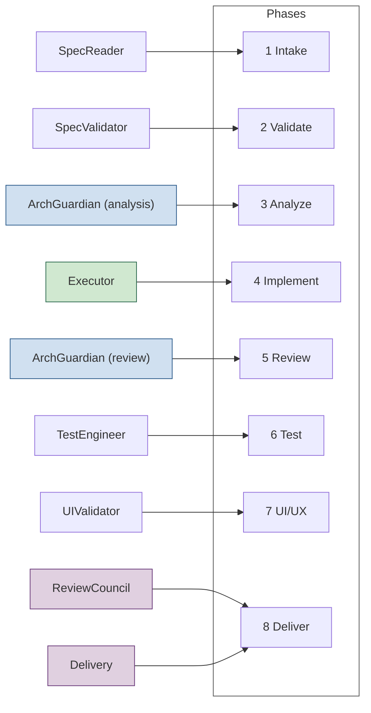
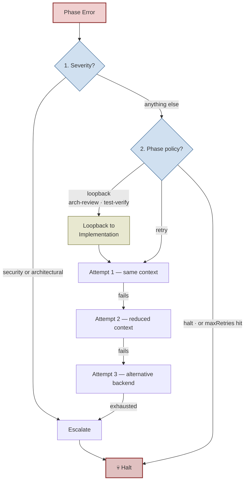

# KASO Architecture

For a full component map (what every service does and how they connect), see [`components.d2`](components.d2) / [`components.svg`](components.svg).

The diagrams below focus on behaviour: how the pipeline runs, how data flows, and how failures are handled.

---

## 1. Dependency Layers

Each layer may only import from layers below it.

---

## 2. 8-Phase Pipeline

Sequential execution. Only `architecture-review` and `test-verification` loop back to Implementation on failure — all other phases either retry themselves or halt.

---

## 3. Context Accumulation

`AgentContext` is immutable and passed forward. Each phase appends its typed output to `phaseOutputs` so later phases can read earlier results.

```mermaid
flowchart LR
    CTX["AgentContext\nrunId · spec · config\nsteering · backends"]

    CTX --> P1["Intake"]
    P1 -->|"+ AssembledContext"| P2["Validate"]
    P2 -->|"+ ValidationReport"| P3["Analyze"]
    P3 -->|"+ ArchitectureContext"| P4["Implement"]
    P4 -->|"+ ImplementationResult"| P5["Review"]
    P5 -->|"+ ArchitectureReview"| P6["Test"]
    P6 -->|"+ TestReport"| P7["UI/UX"]
    P7 -->|"+ UIReview"| P8["Deliver"]
    P8 -->|"+ DeliveryResult"| DONE["Complete"]

    style CTX  fill:#d0e0f0,stroke:#2a5a8a,stroke-width:2px
    style DONE fill:#d0e8d0,stroke:#2d6a4f,stroke-width:2px
```

---

## 4. Agent Map

`ArchitectureGuardian` is the only agent that runs in two phases (analysis read-only, then review after implementation).

---

## 5. Error Recovery

Two independent decisions: classify the error's severity first, then apply the failing phase's policy. Loopback is a phase-level policy, not an error type — only `architecture-review` and `test-verification` have it.

